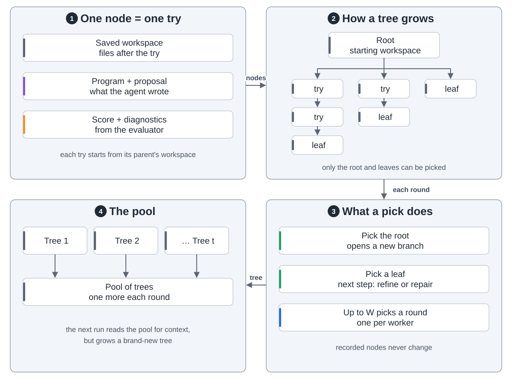
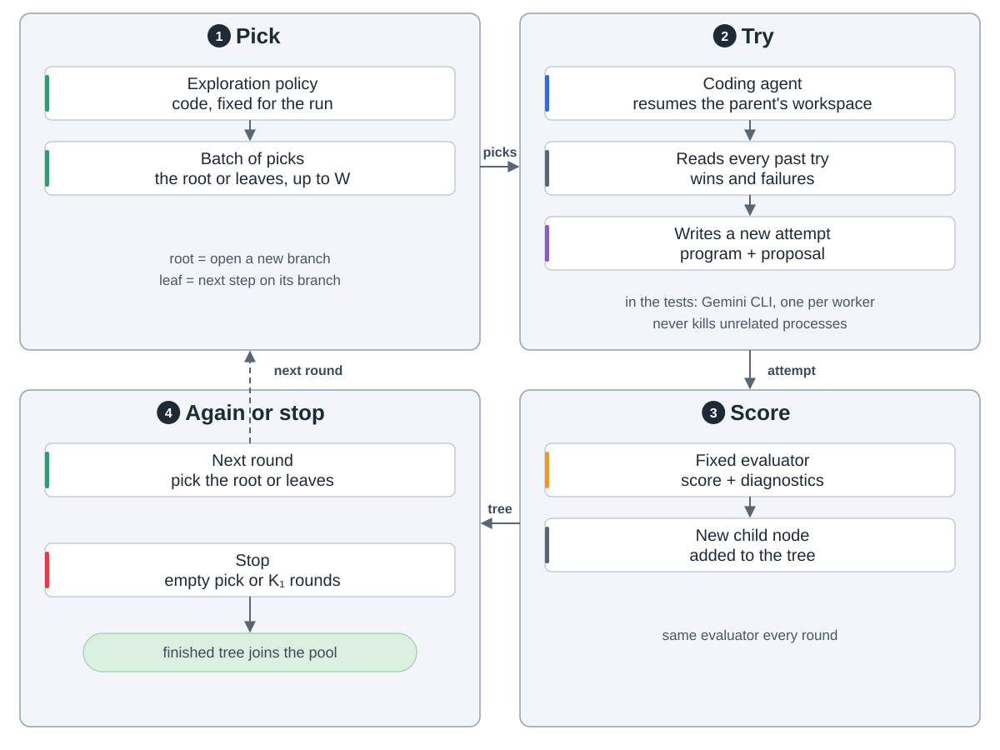
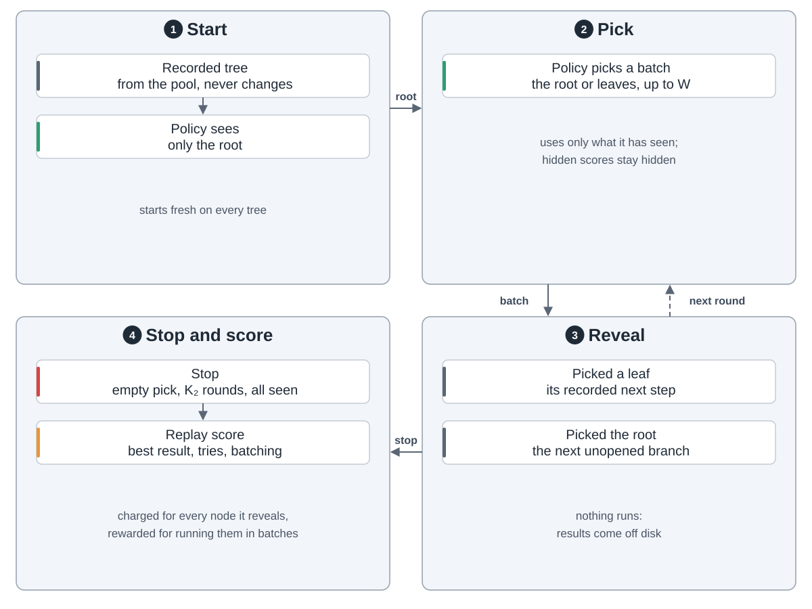
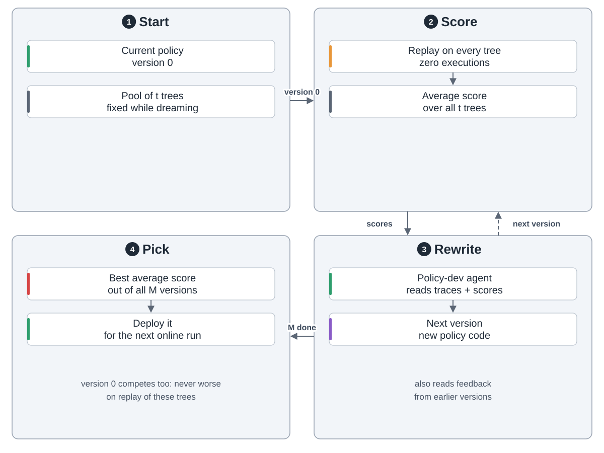
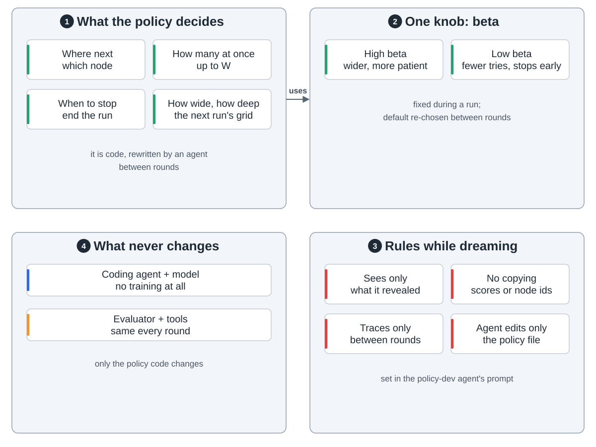
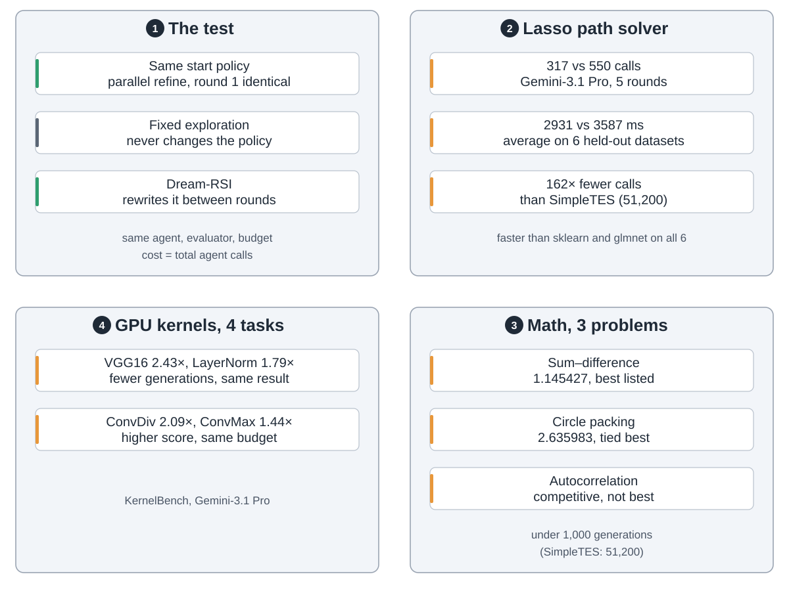
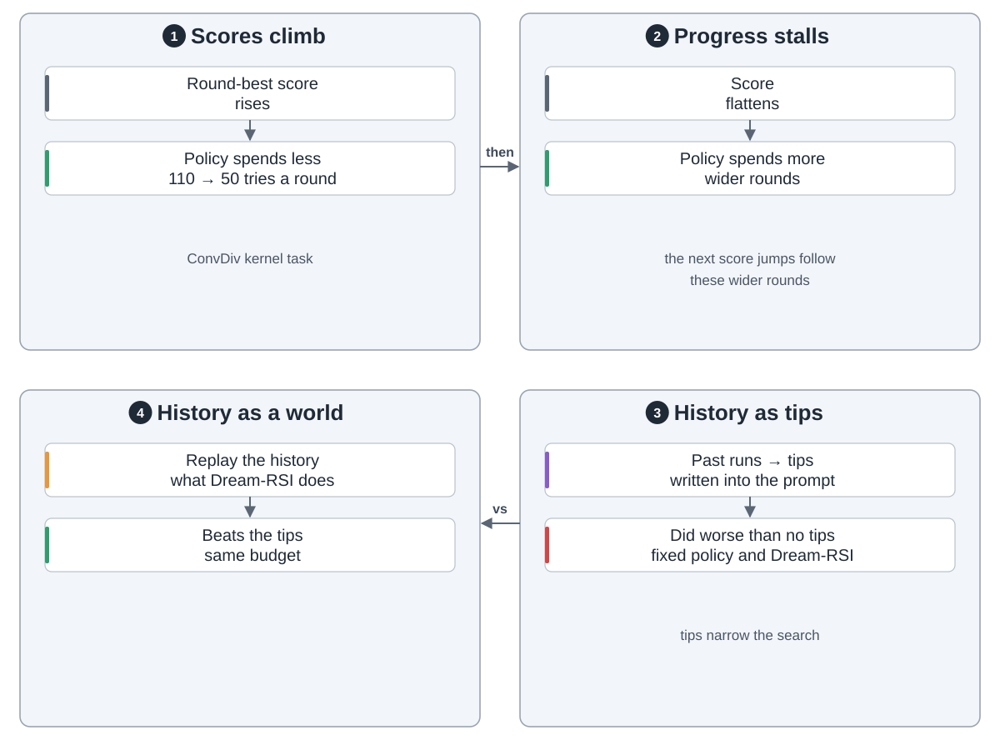

AI 做研究要试很多轮。算力花得值不值，看探索：从哪分叉、几路并行、何时停。这套策略通常写死，想换就得整轮重跑。

Dream-RSI 来自谷歌，想法是：**跑完的记录就是模拟器。**代码未发布，以下据论文。

**发现树。**一个节点是一次尝试：工作区、程序、分数。选根开新分支，选叶子往下走一步。

**1. 在线探索。**策略每轮最多选 W 个节点。编码智能体读完旧尝试再接着做，评估器打分。树进池子。

**2. 回放。**新策略换种走法走旧树，结果现成，不用重跑。分数看最好结果、尝试次数、并行程度。

**3. 做梦。**另一智能体把策略改 M 版，每版在所有树上回放，分数指导下一版。最高分上线。当前版也参赛，回放分不会变差。

策略是代码，还定下一轮多宽多深。做梦时只看已揭开的部分。模型和评估器不变。

**结果。**八个任务，对照固定策略。Lasso 上调用少 1.7 倍，比 SimpleTES 少 162 倍。

学到的策略涨时省、停时多花。把历史写成提示，不如回放。

