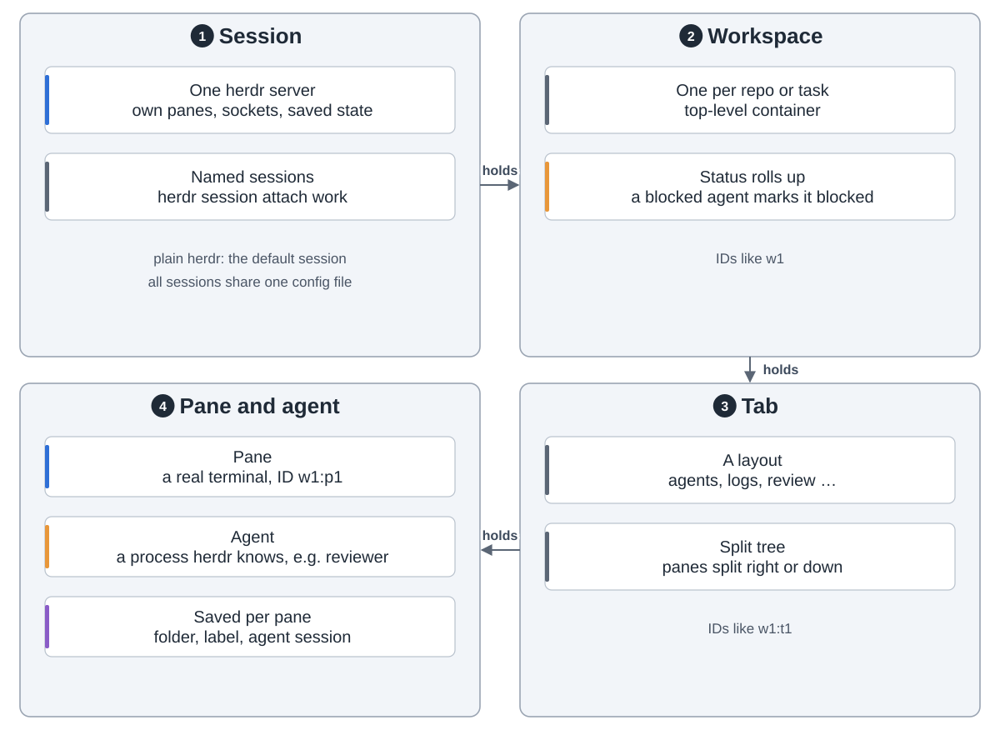
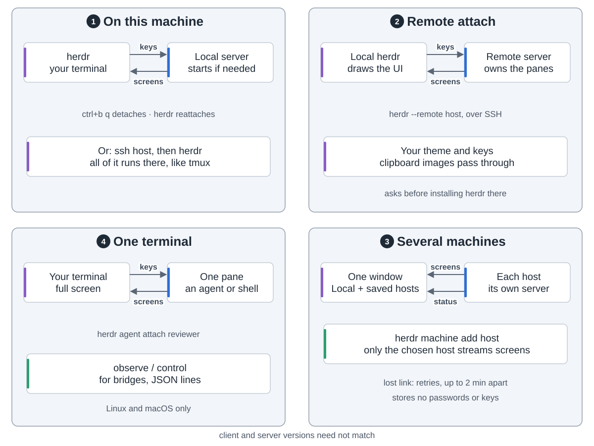
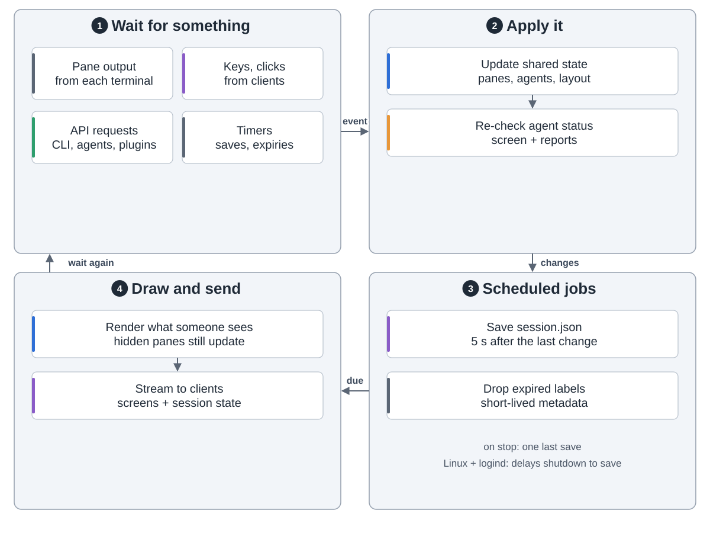
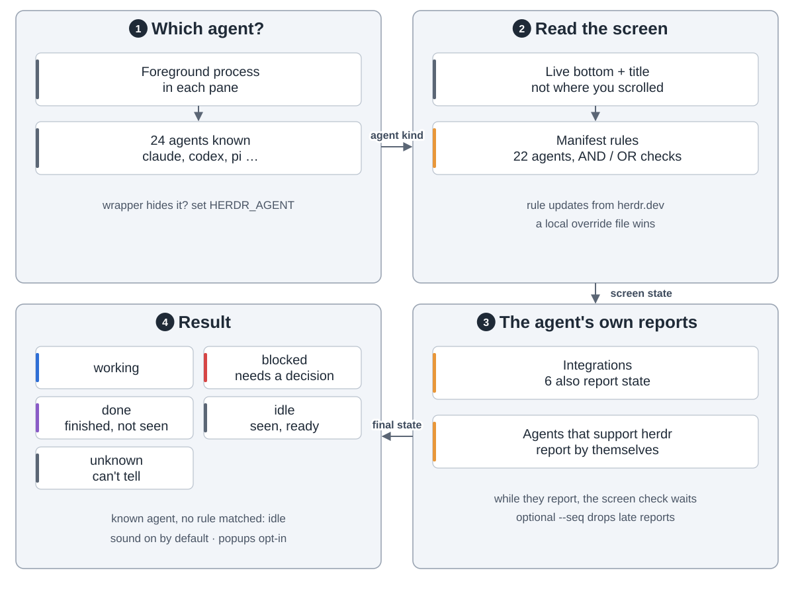
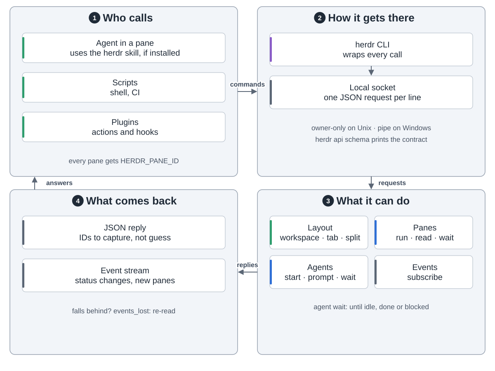
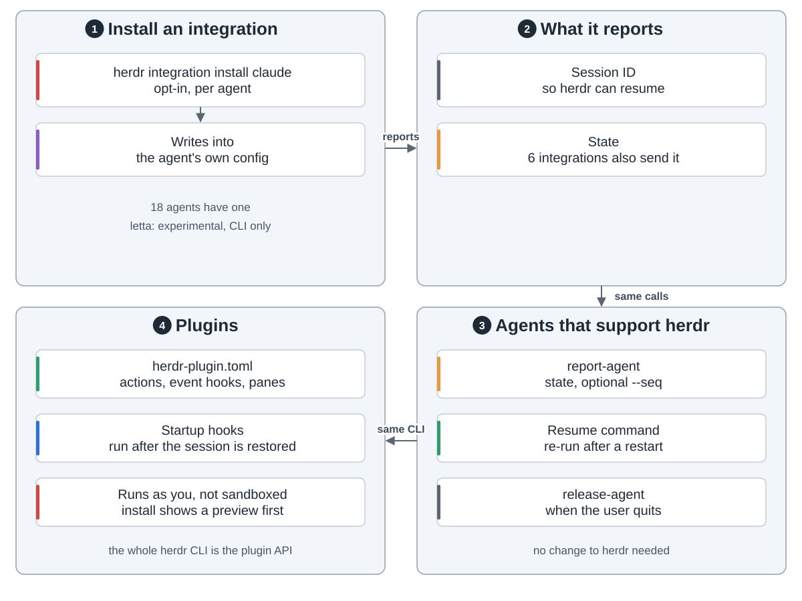
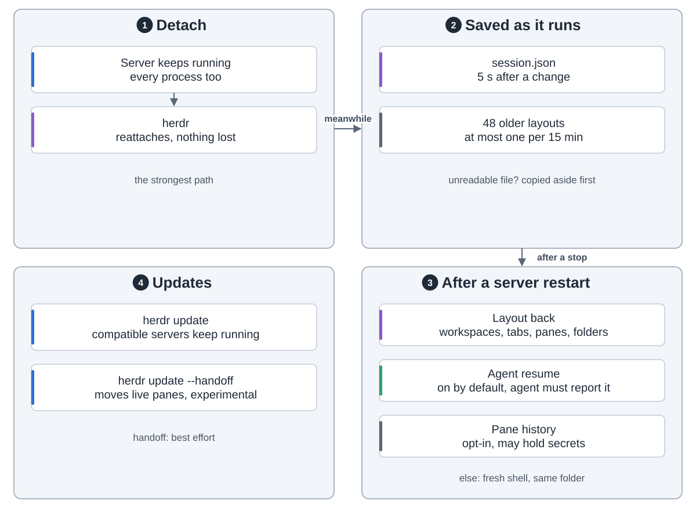

You run Claude Code, Codex and the rest in terminals. Close the laptop or drop SSH and they die. Run five at once and you keep hunting for the one that's waiting on you.

herdr is one Rust binary, split like tmux: **a server owns the terminals, clients just draw.**

**Structure.** One server per session. A session holds workspaces, a workspace holds tabs, a tab holds panes. A pane is a real terminal. An agent is a process recognised in a pane.

**Ways in.** A local window, SSH, `herdr --remote`, several machines in one window, or just one pane. `ctrl+b q` detaches and the work keeps going.

**The loop.** Wait for output, keys, API calls or timers. Update the state, save `session.json` 5 seconds after a change, and draw only what someone is looking at.

**Who's stuck.** herdr finds the agent's process and reads the bottom of its screen against per-agent rules (22 manifests). It marks the pane working, blocked, done or idle. Six integrations, and agents built for herdr, report their own state.

**Agents driving agents.** Through the `herdr` CLI or a local socket, an agent can open panes, prompt another agent and wait until it's done or blocked.

`herdr integration install` is opt-in. It adds a hook that reports the session ID. Plugins run as you, with no sandbox.

**If the server stops**, the processes are gone. The layout comes back with fresh shells. Agents that reported a session resume it. Pane history is opt-in. `herdr update --handoff` keeps processes alive, but it is experimental.

