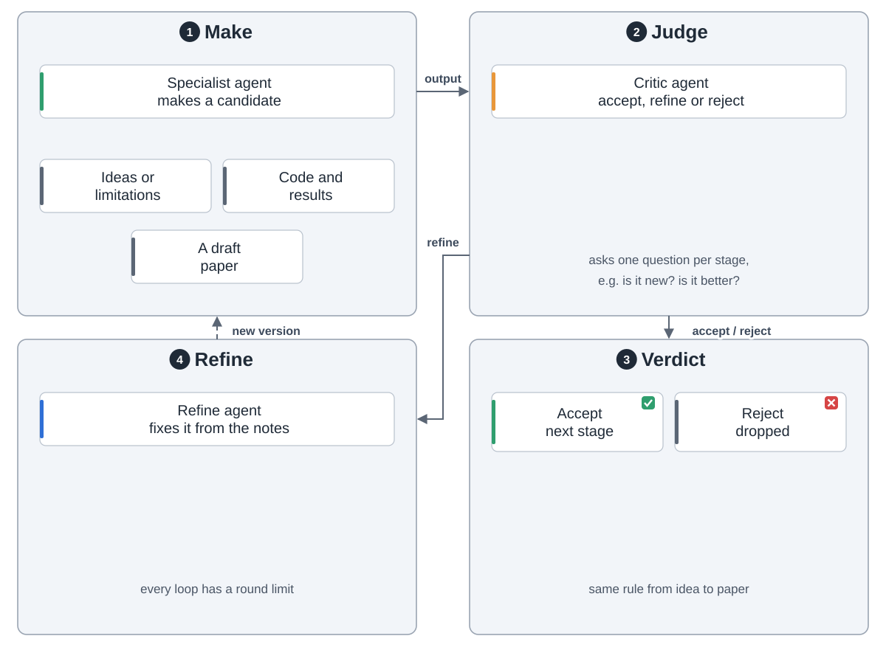
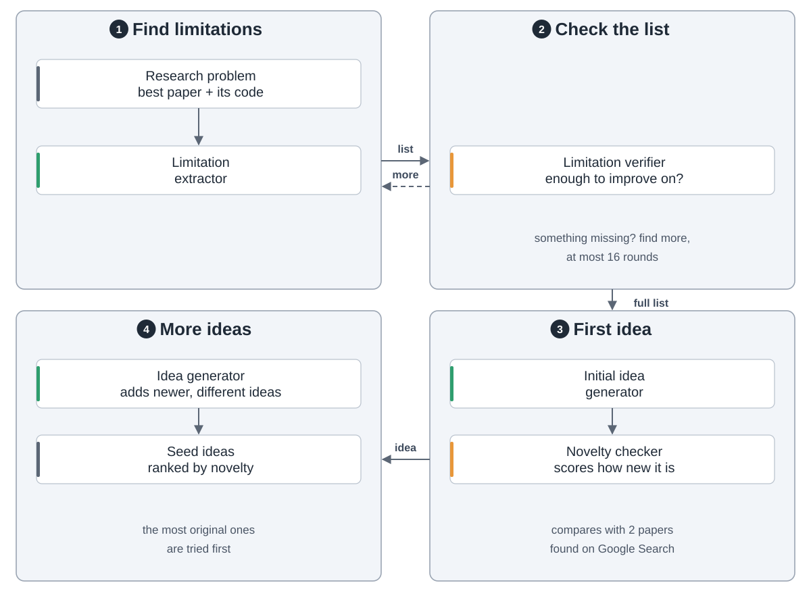
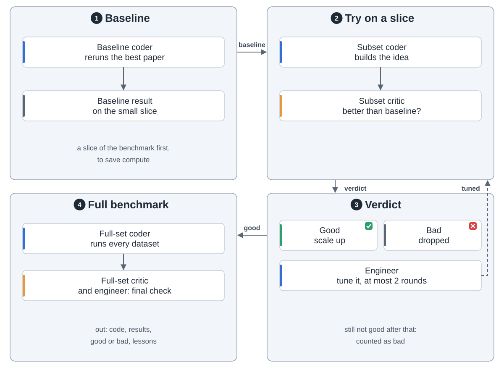
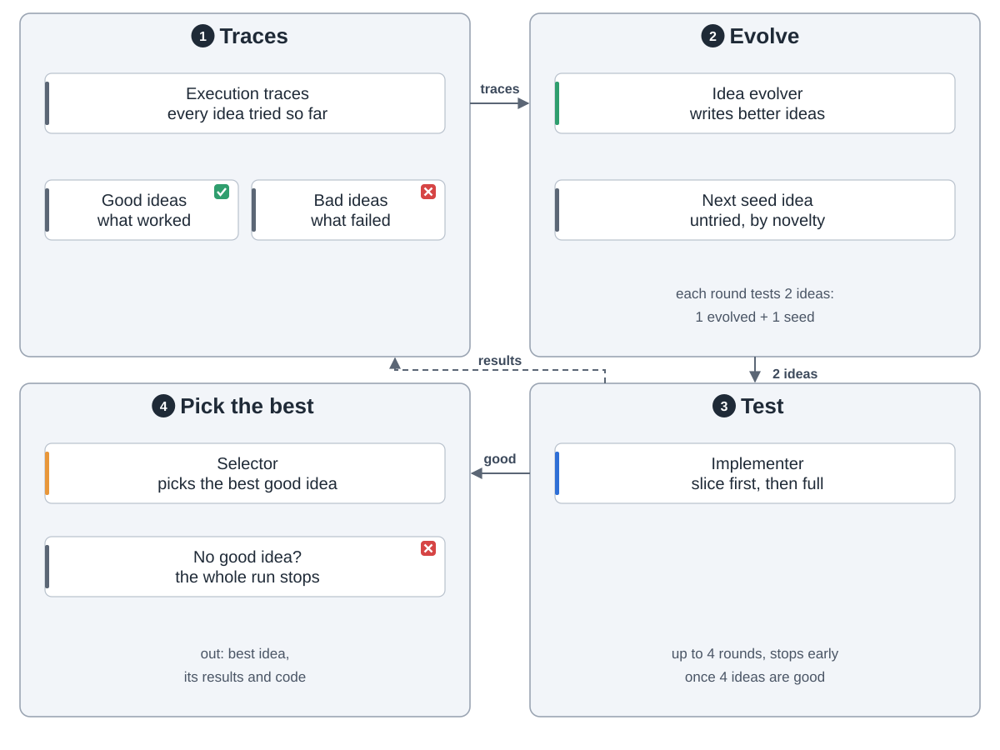
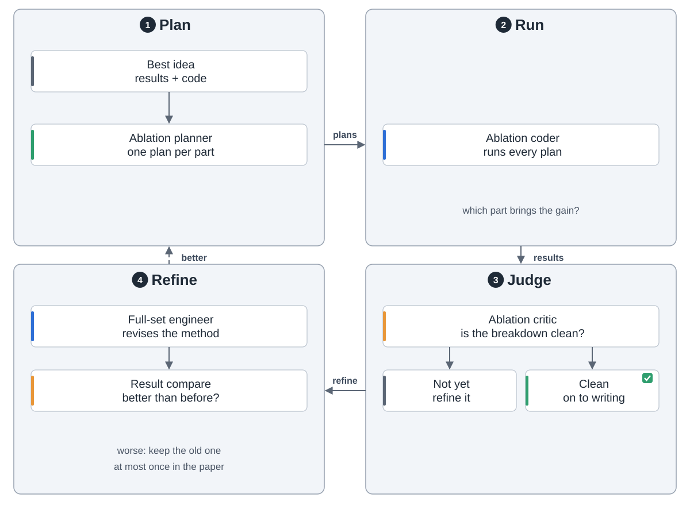
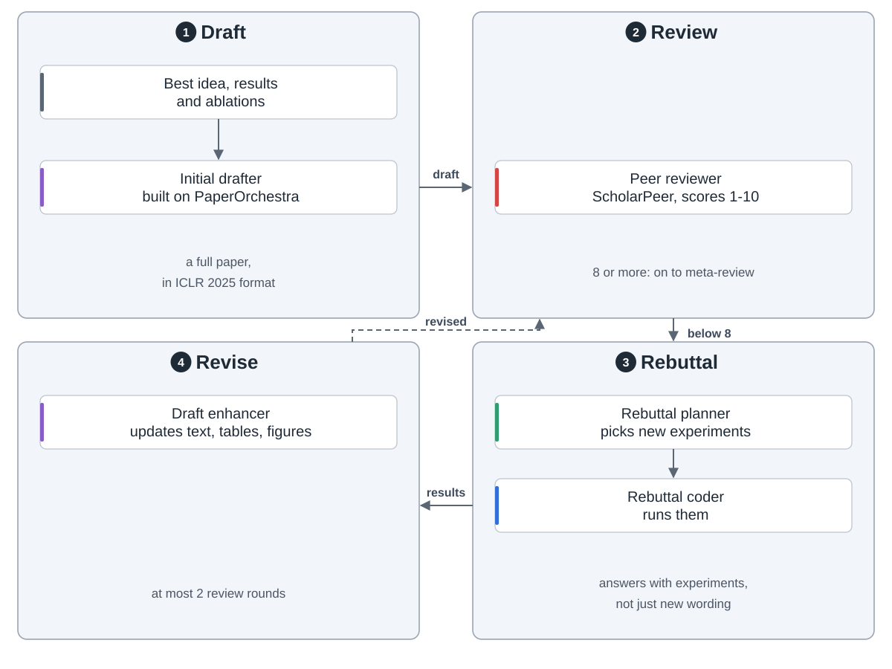
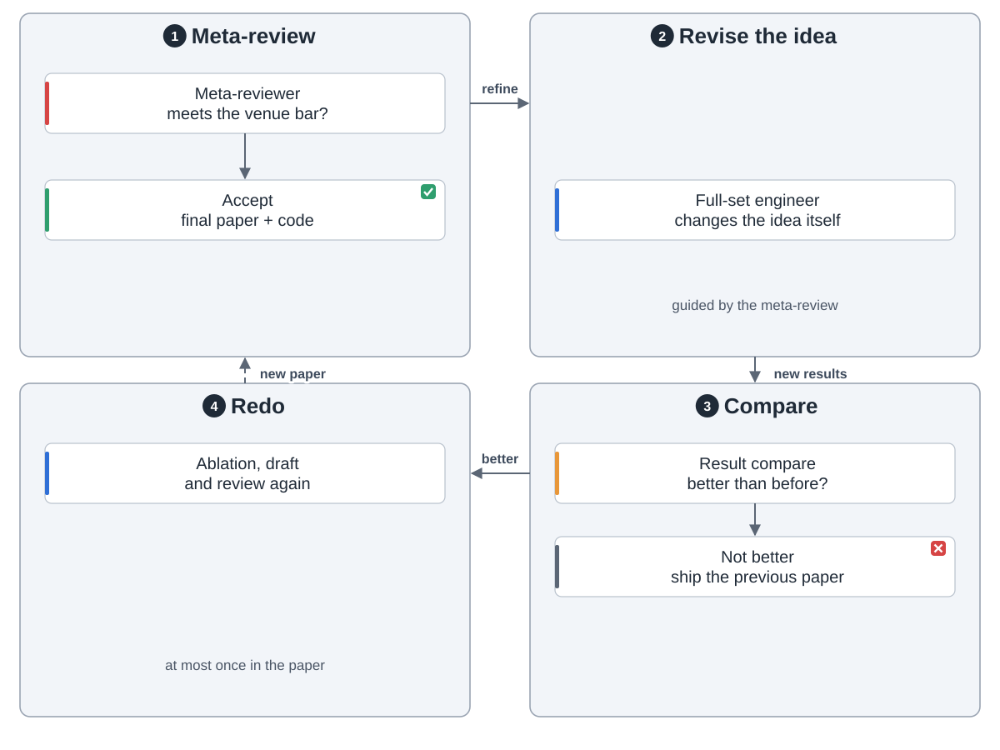
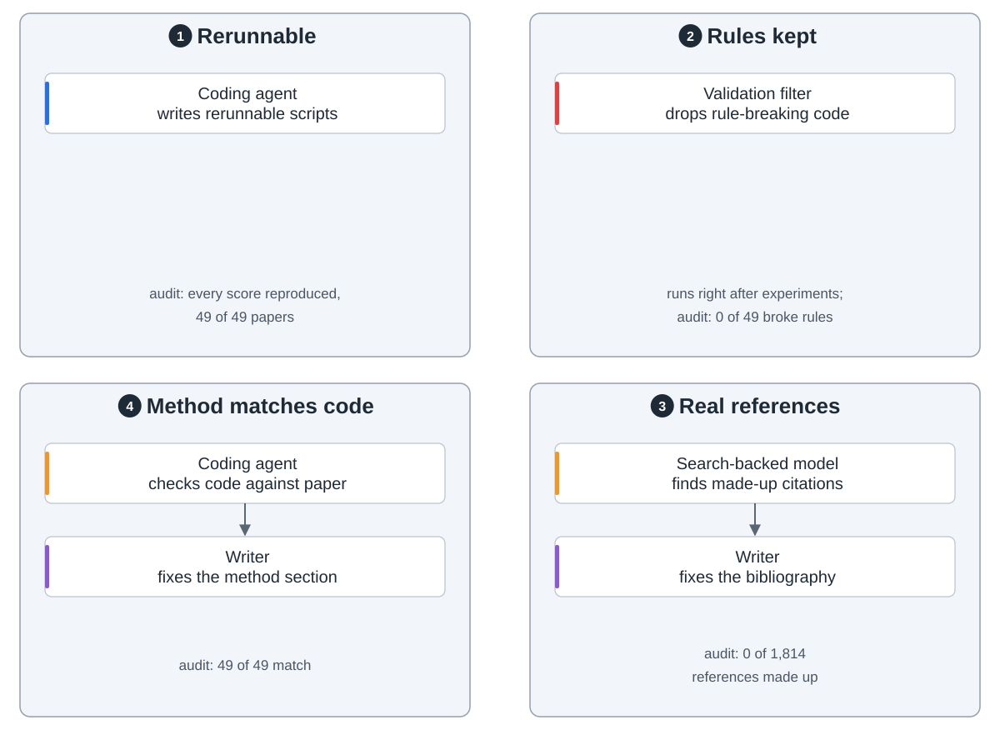
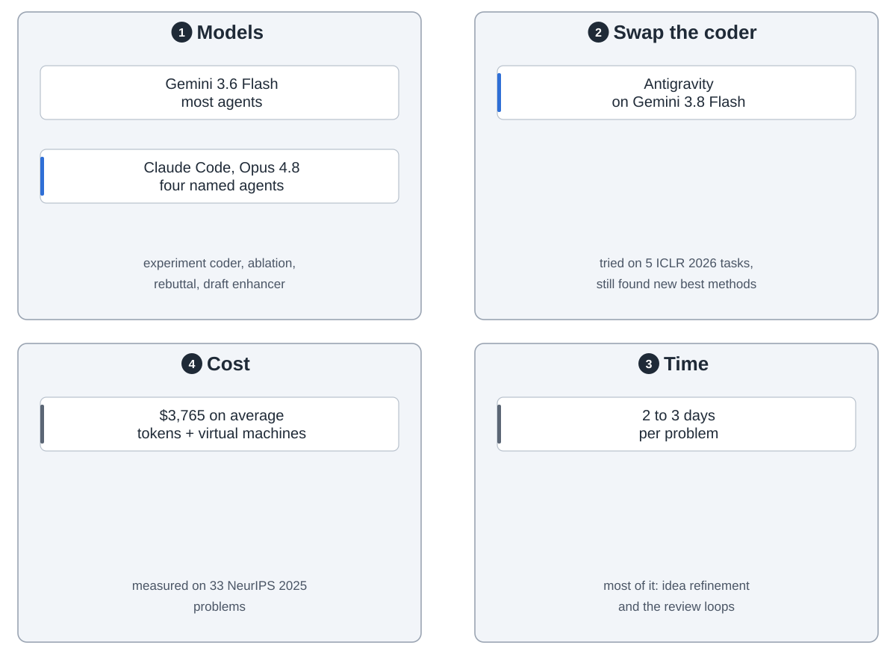
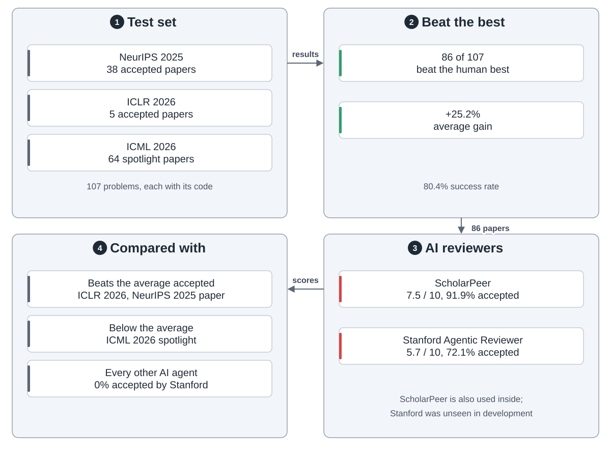

ScientistTwo is a research agent from Google Cloud AI Research. You give it a research problem, plus the current best paper and its code. It comes up with ideas, runs experiments, writes the paper and reviews it, with no human in the loop.

Every stage works the same way. One agent makes something, and a critic accepts it, rejects it or asks for a fix. Each loop has a round limit.

**1. Ideas.** It lists what the best method gets wrong, writes ideas that fix it, and ranks them by novelty.

**2. Experiments.** Each idea runs on a small slice of the benchmark first. Only ideas that beat the baseline get the full benchmark.

Results from every idea feed an evolver that writes better ones. A selector picks the best.

**3. Ablation.** It removes parts one at a time to see which ones matter, and may revise the method once.

**4–5. Writing and review.** An AI reviewer scores the draft. Below 8 out of 10, a rebuttal agent runs new experiments and the draft is updated.

**6. Meta-review.** A last reviewer accepts the paper or sends the idea back for one more fix. If the fix doesn't beat the old results, it is dropped and the previous paper ships.

Four checks keep it honest: code that reruns, a filter for rule-breaking code, real citations, and a method section that matches the code.

Most agents run on Gemini 3.6 Flash. Four, including the experiment coder, use Claude Code with Opus 4.8. One problem takes 2 to 3 days and $3,765 on average.

On 107 problems taken from NeurIPS, ICLR and ICML papers, it beat the human best on 86, by 25.2% on average.

