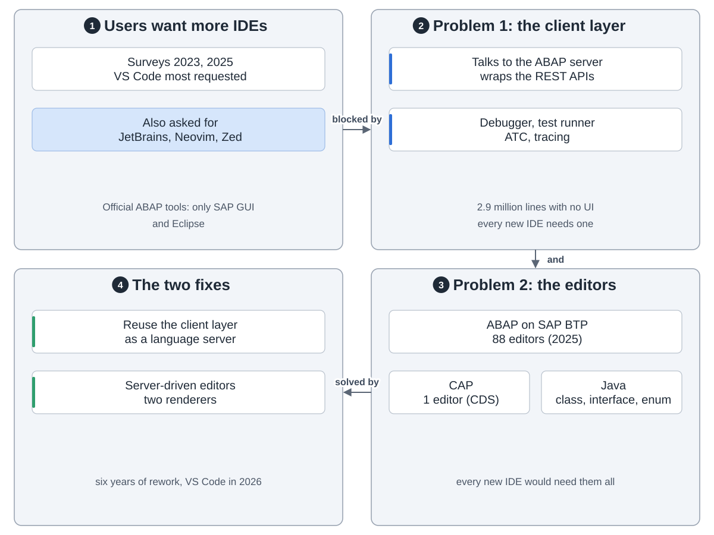
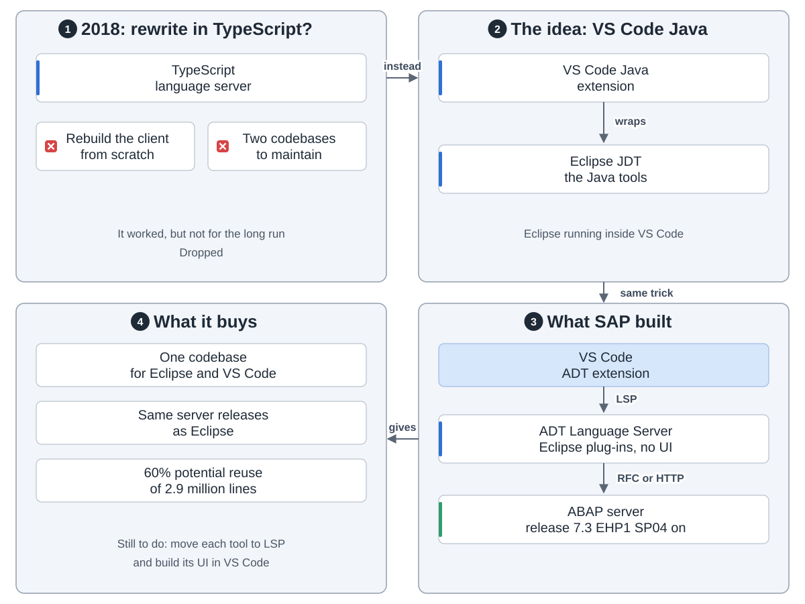
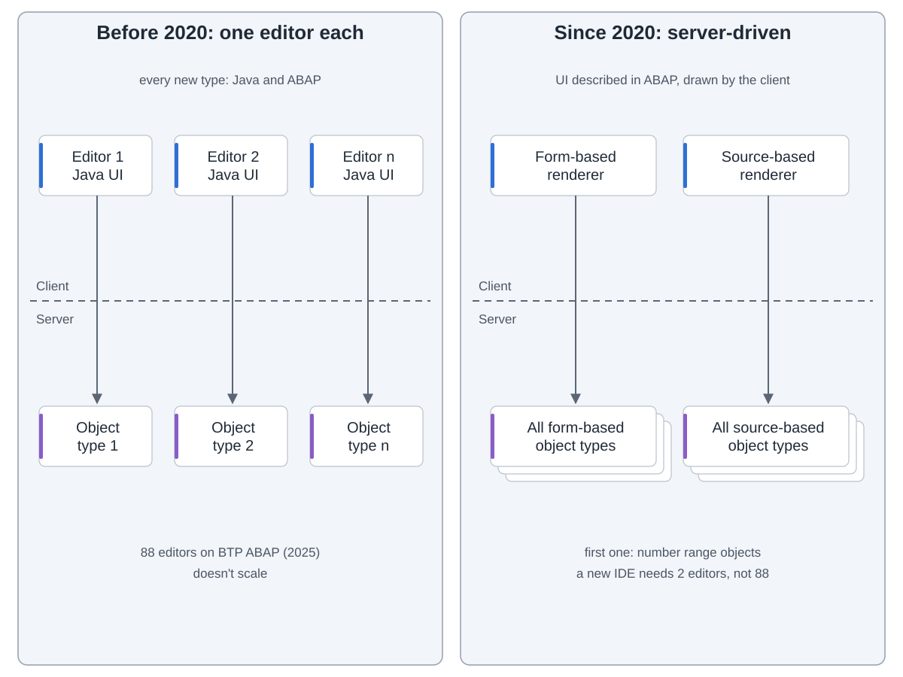
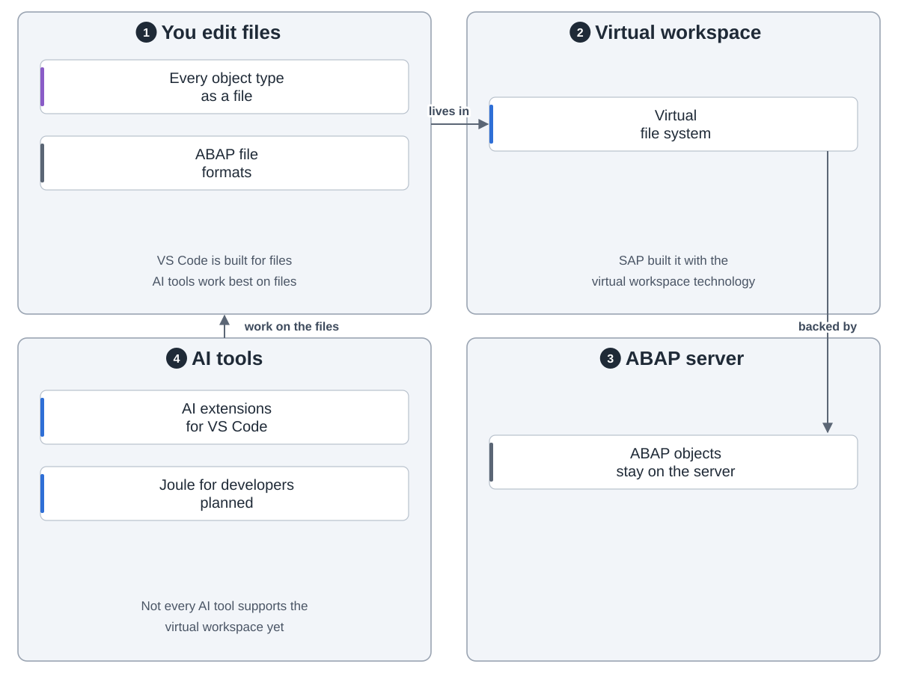
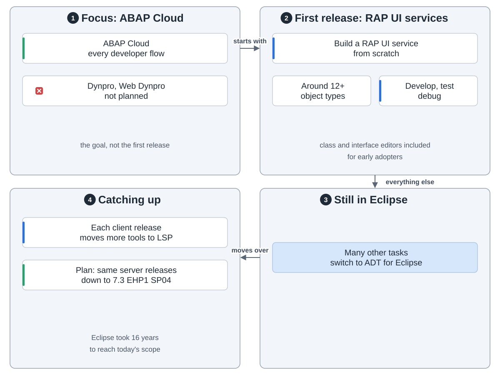
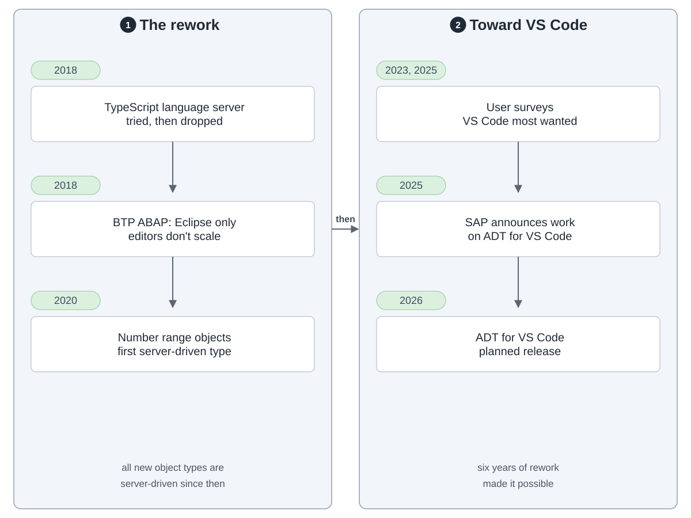

ADT 是在 SAP GUI 之外写 ABAP 的工具。以前只有 Eclipse，2026 年起也有 VS Code，客户端没重写。

IDE 管界面。下面的客户端层没有界面：封装 ADT REST API，带调试器、测试运行、ATC、跟踪。它经 RFC 或 HTTP 连 ABAP 服务器，7.3 EHP1 SP04 起都是同一套 API。

**难在哪。**用户想要 VS Code。可每个新 IDE 都要一套 290 万行的客户端层，光 SAP BTP ABAP 环境就有 88 个编辑器。

**办法一：复用客户端。**2018 年试过用 TypeScript 重写，因要维护两套代码而放弃。VS Code 的 Java 扩展把 Eclipse 的 Java 工具包成语言服务器，SAP 照做：VS Code 用 LSP 连 ADT Language Server，即去掉界面的 Eclipse 插件。SAP 估计能复用 60%。

**办法二：编辑器由服务器描述。**以前一个编辑器要客户端写 Java 界面、服务器写 ABAP。2020 年从号码范围对象开始，新对象类型都由服务器用 ABAP 描述，客户端用表单类或源码类渲染器画。新 IDE 只要两个编辑器，不是 88 个。

**文件。**VS Code 里按文件编辑，因为 AI 工具最擅长文件。对象还在服务器上，靠虚拟工作区接入，有些 AI 工具还不支持。

**第一版。**主攻 ABAP Cloud 的 RAP UI 服务，约 12 种以上对象类型。不打算做 Dynpro。别的工作还得用 Eclipse，VS Code 逐版追上。

