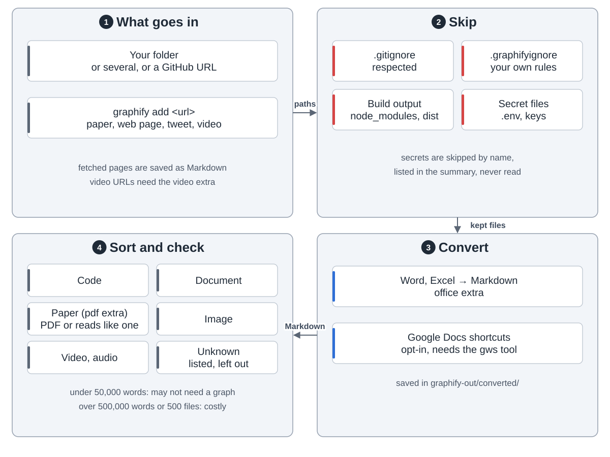
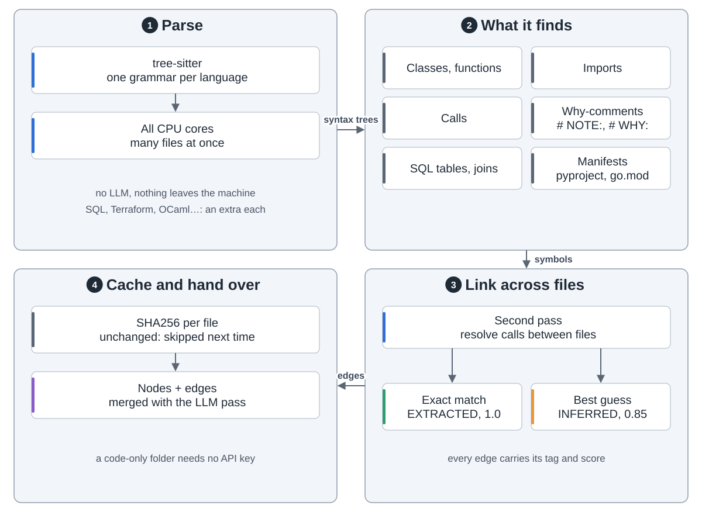
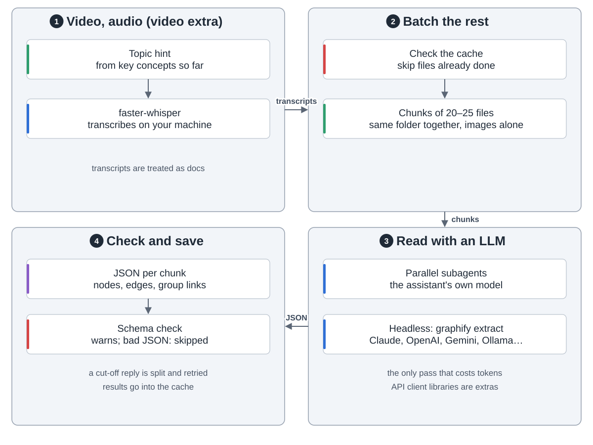
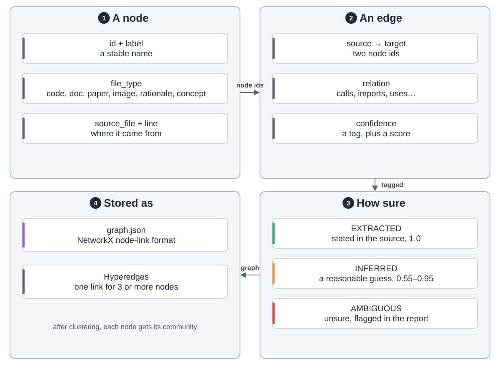
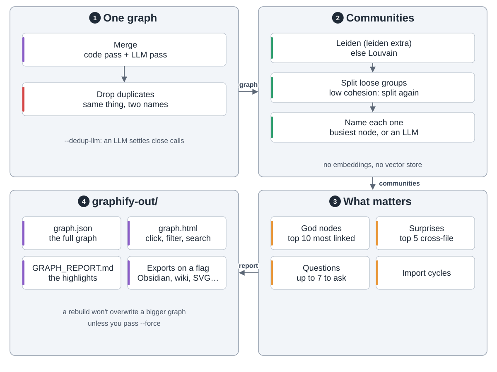
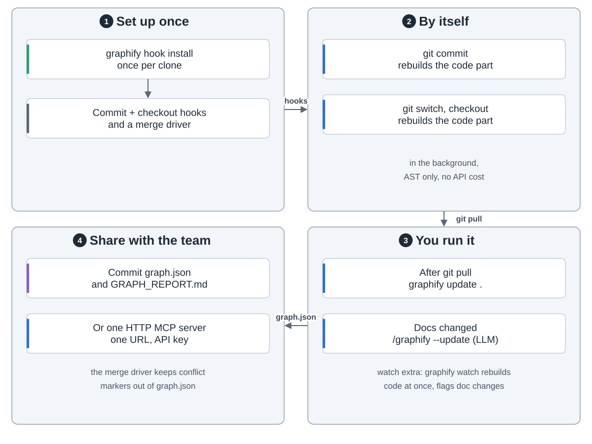
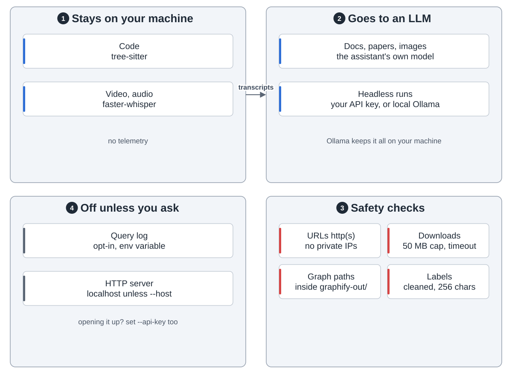
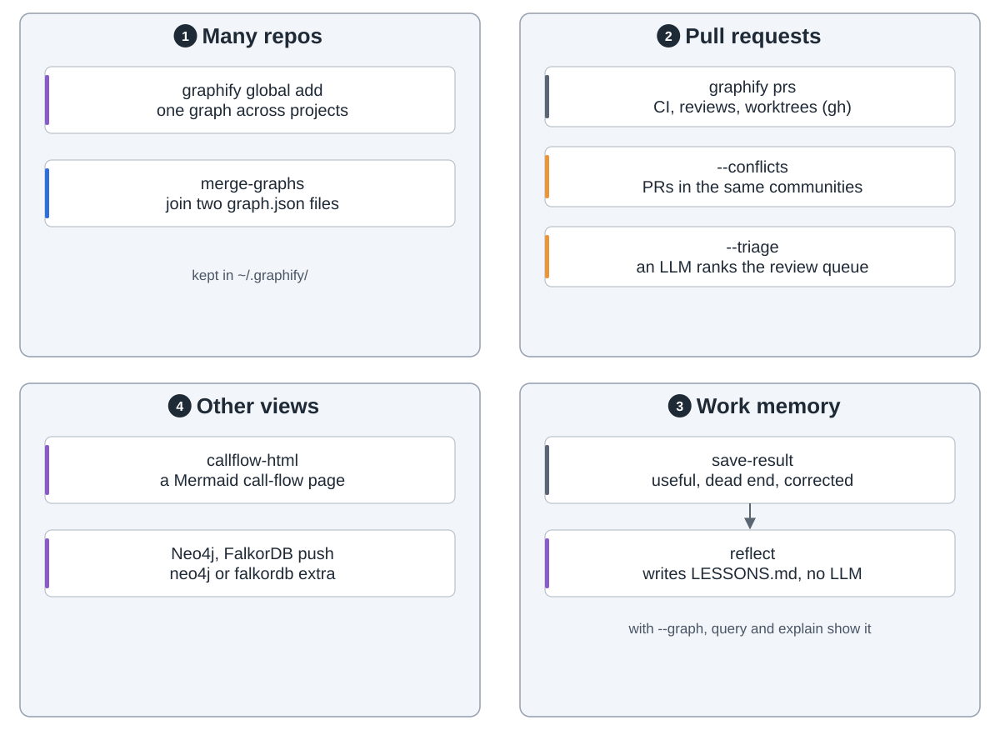

graphify turns a folder of code, docs, papers, images and video into one knowledge graph. Your AI assistant then asks the graph instead of grepping files. It is a skill (`/graphify .`) on top of a Python library.

**1. Read the folder.** `detect()` skips ignored files, build output and secrets, then sorts the rest by type.

**2. Pull out the facts.** Code is parsed on your machine with tree-sitter: no LLM, no cost. A second pass links calls across files.

Video and audio are transcribed locally (video extra). Docs, papers, images and transcripts go to an LLM in parallel batches. Only this pass costs tokens. A SHA256 cache skips unchanged files.

Every edge says how sure it is: `EXTRACTED` (in the source), `INFERRED` (a scored guess) or `AMBIGUOUS` (for a person to check).

**3. Build the map.** Everything merges into one NetworkX graph, minus duplicates. Leiden (leiden extra, else Louvain) groups it into communities by its links. No embeddings, no vector store. The report lists god nodes, surprising links and questions to ask.

**4. Use it.** `graphify claude install` adds a CLAUDE.md section and a hook. Before the assistant searches or reads files, the hook points it to `graphify query`. The CLI or an MCP server (mcp extra) answers with a small subgraph, not whole files.

`graphify hook install` rebuilds the code part on every commit and branch switch, for free. After `git pull`, run `graphify update .`.

Code is never sent anywhere. Docs, images and transcripts go to your assistant's model or an API you choose.

Side tools cover several repos, pull requests and work memory.

On 52 mixed files, a query used 71.5x fewer tokens than reading the files. On 6 files there was no saving.
