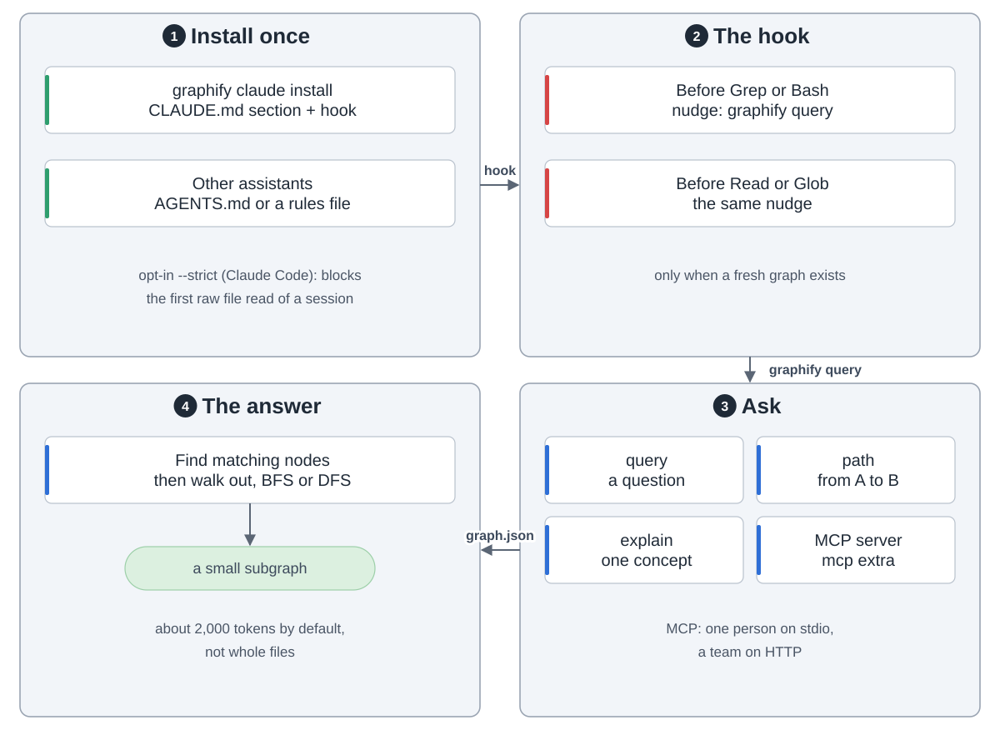

graphify turns a folder of code, docs, images and video into one knowledge graph. Your assistant then queries the graph instead of grepping files. It runs as a skill (`/graphify .`) backed by a Python library.

1. **Scan**: `detect()` sorts files by type.
2. **Extract**, in three passes. A SHA256 cache skips files that haven't changed. Code goes through tree-sitter, locally, with no LLM. Video and audio (video extra) are transcribed locally with faster-whisper. Docs, images and transcripts go to parallel LLM subagents; only this pass costs tokens. Each edge is tagged `EXTRACTED` (stated in the source), `INFERRED` (with a score) or `AMBIGUOUS` (flagged for review).
3. **Build and cluster**: the pieces become one NetworkX graph. Leiden splits it into communities by edge density (leiden extra; otherwise Louvain). No embeddings, no vector store. Then it finds god nodes and surprising links across modules.
4. **Output** in `graphify-out/`: `graph.json`, a clickable `graph.html`, and `GRAPH_REPORT.md` with the highlights. Obsidian, wiki, SVG, GraphML and Cypher exports are optional.

`graphify claude install` adds a CLAUDE.md section and a PreToolUse hook. Before a search or a file read, the hook points the assistant to `graphify query`. Platforms without hooks get an instruction file such as `AGENTS.md`. The graph answers through the CLI (`query`, `path`, `explain`) or an MCP server (mcp extra), over stdio for one person or HTTP for a team. Either way the assistant gets a small subgraph, not raw files.

`graphify hook install` keeps it current. Commits and branch switches rebuild the code part in the background, with no API cost. After `git pull`, run `graphify update .`. When docs change, run `/graphify --update`.

On a mixed corpus of 52 files, a query used 71.5x fewer tokens than reading the files. On 6 files there was no saving.
