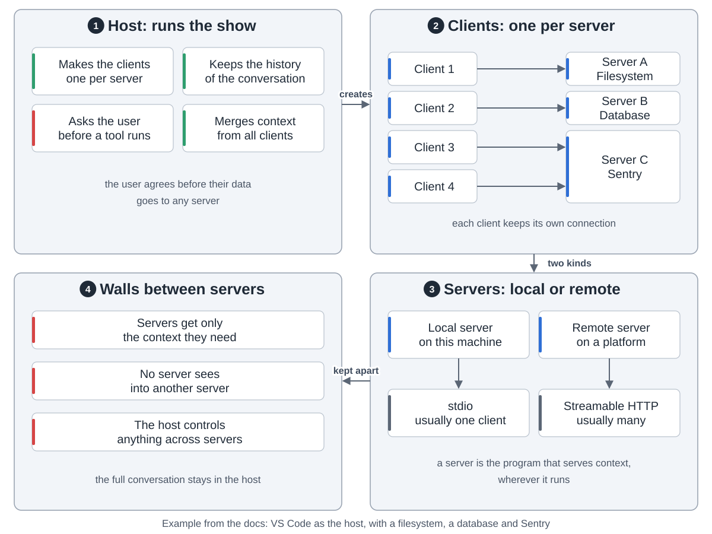
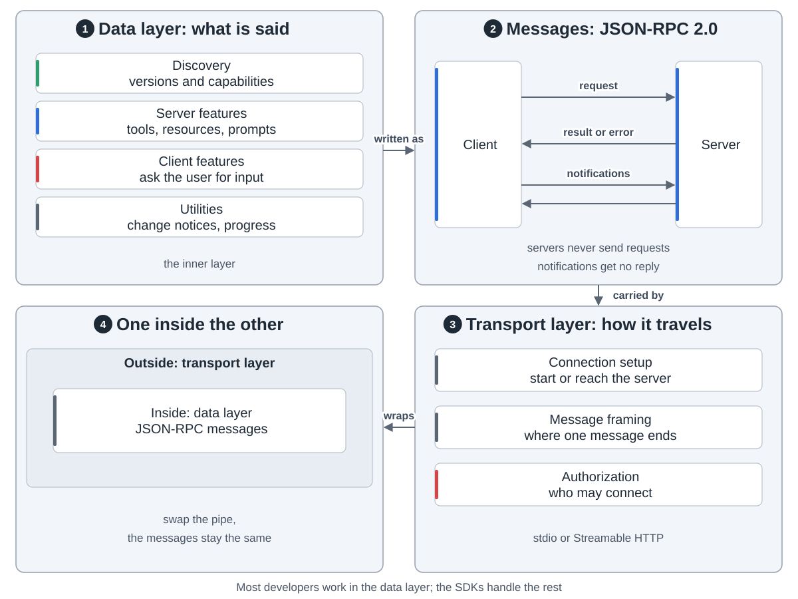
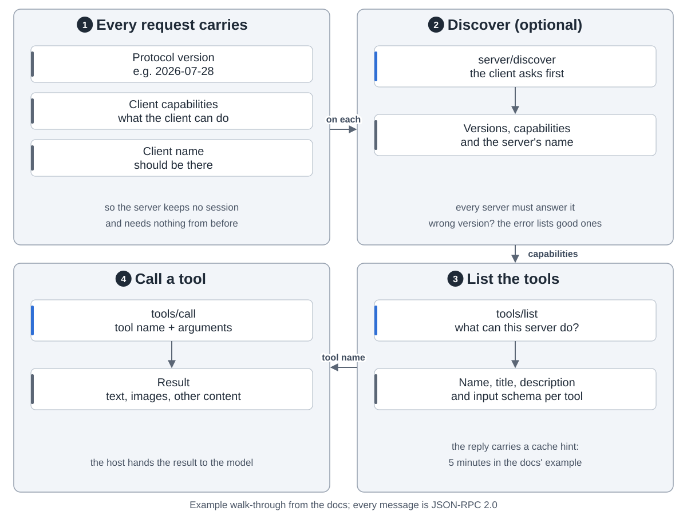
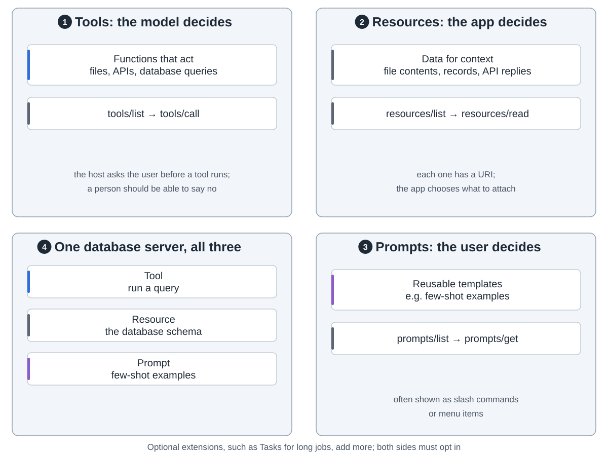
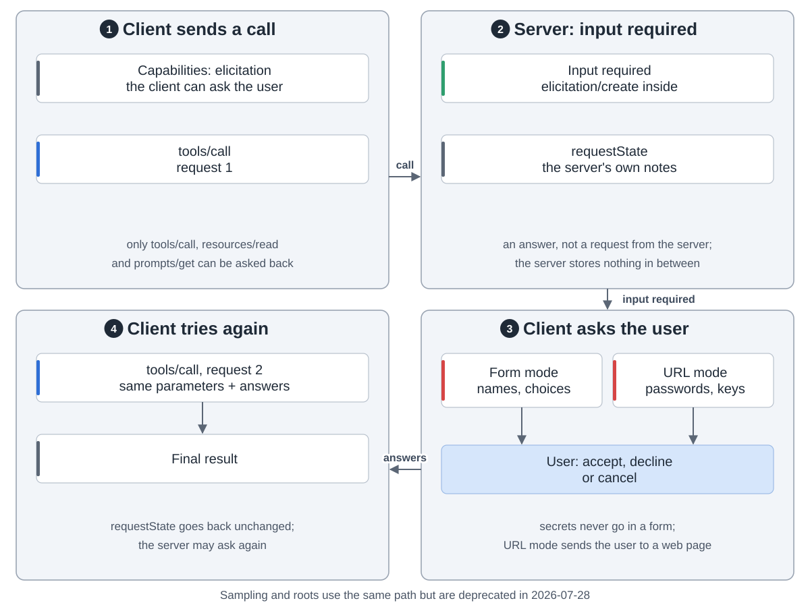
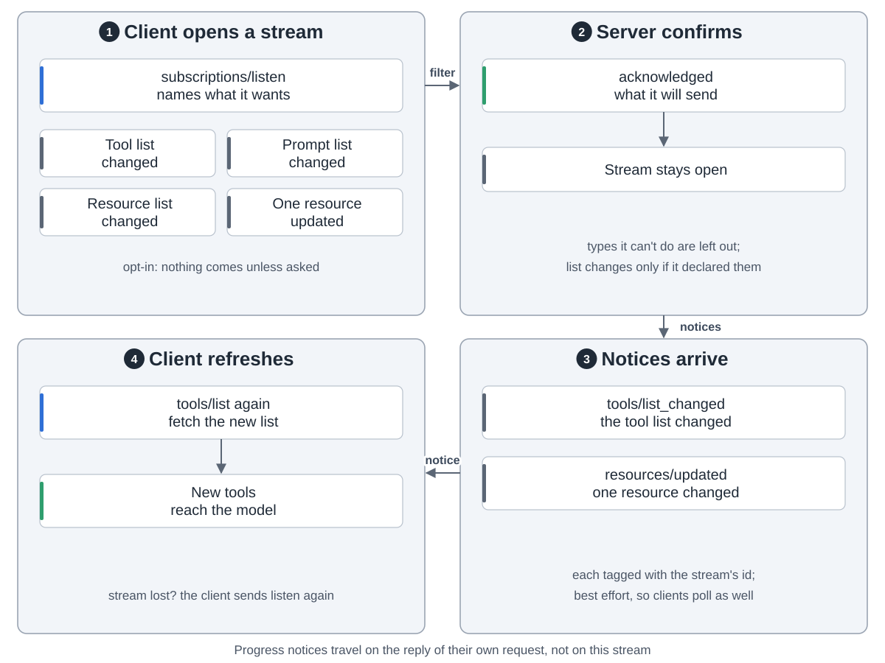
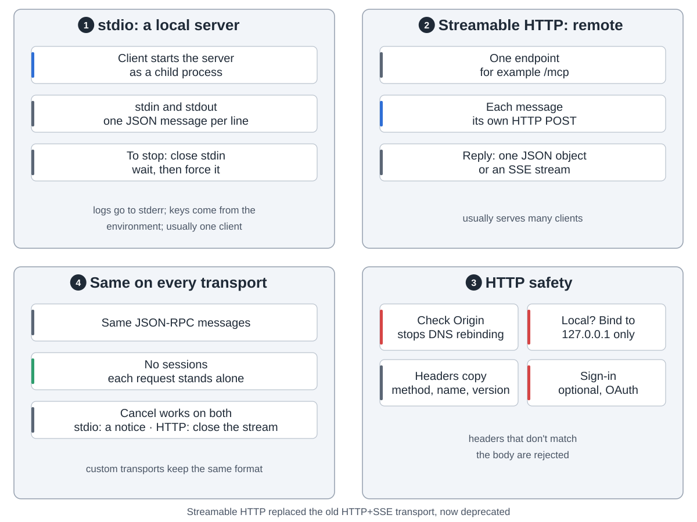
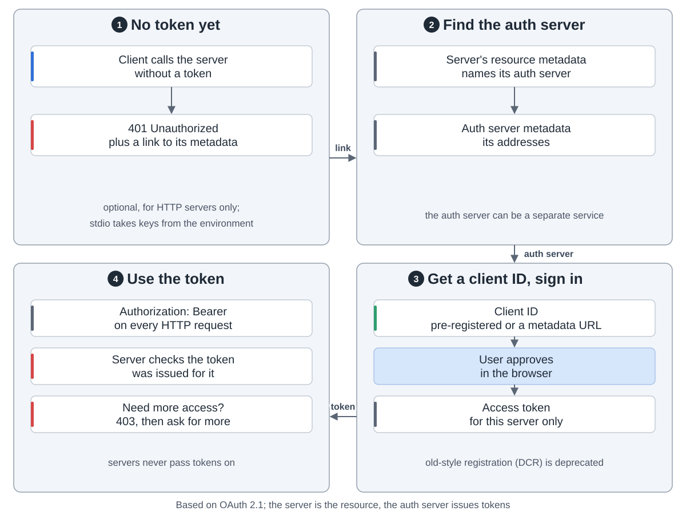

An AI app wants to read your files, query a database or check Sentry. MCP is one plug for all of them, so each tool doesn't need its own integration. This is protocol version `2026-07-28`.

**Who takes part.** The host is the AI app, like Claude Code or VS Code. It makes one client per server, keeps the conversation and asks the user before a tool runs. Servers see only what they need.

**Two layers.** Inside, the data layer is the messages: JSON-RPC 2.0. The client sends requests, the server answers. Outside, the transport layer is the pipe.

**One request.** Every request carries the protocol version and the client's capabilities, so the server keeps no session. `server/discover` says what a server supports. Then `tools/list` and `tools/call`.

**What servers offer.** Tools the model calls, resources the app reads, prompts the user picks.

**Asking the user.** A server sends no requests. It answers "input required", the client asks the user, then sends the call again with the answers. Passwords go through a web page, never a form.

**Hearing about changes.** The client opens `subscriptions/listen` and picks what to hear, such as "the tool list changed". It's opt-in and best effort.

**Transports.** Local servers use stdio: the client starts them as child processes. Remote ones use Streamable HTTP: each message is a POST, the reply is JSON or an SSE stream.

**Signing in** is optional and only for HTTP. The server points to its auth server, the user approves in the browser, then every request carries the token.

MCP only moves context. How to use it is up to the app.
