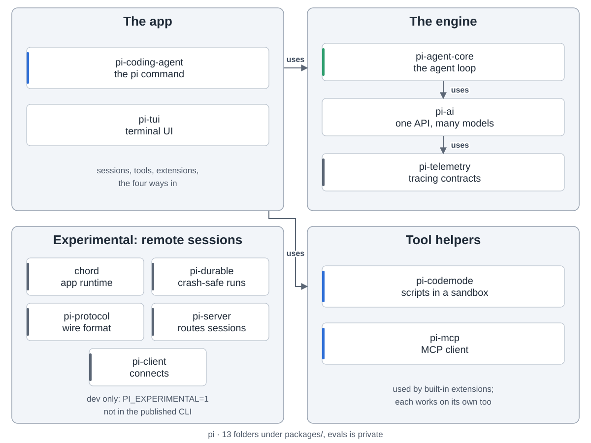
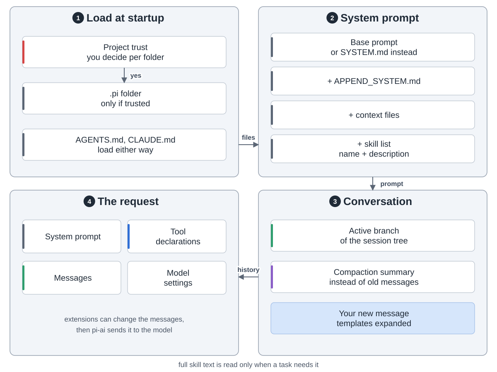
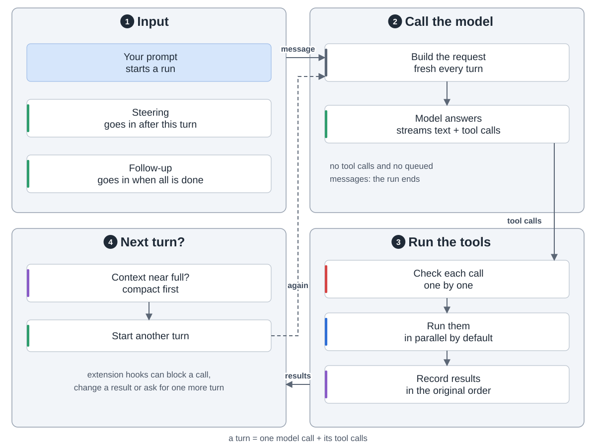
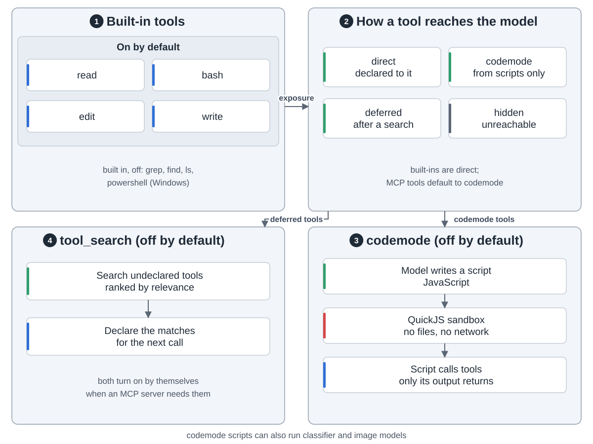
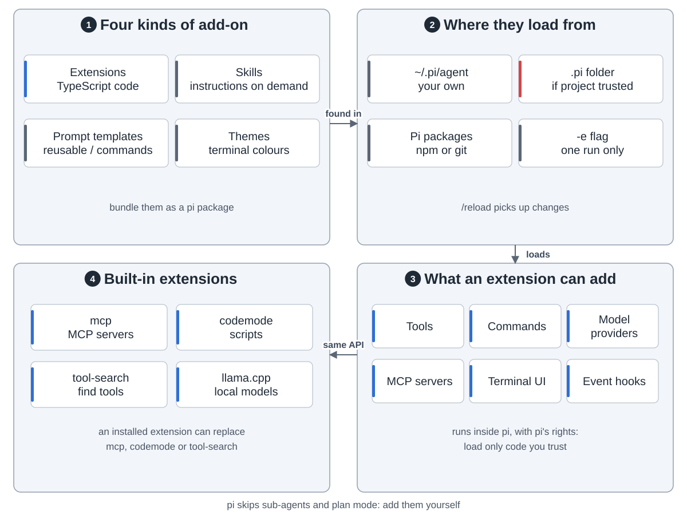
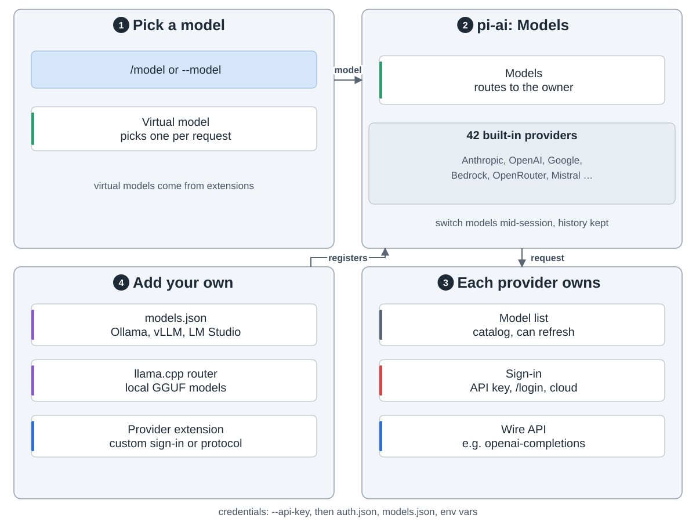
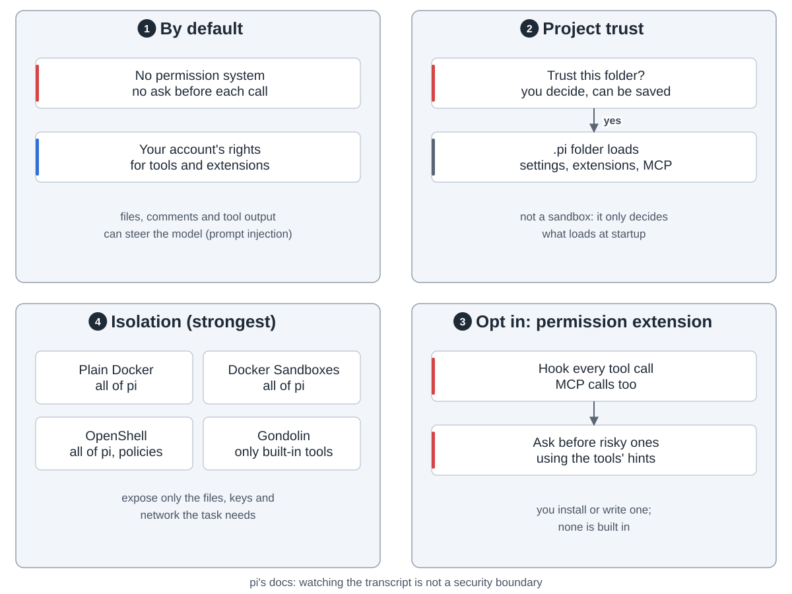

Pi is a small, open coding agent for the terminal. Missing a feature? You add it yourself.

**Overview.** Four ways in: the terminal UI, print or JSON mode, RPC and the SDK. All four share one session. Pi builds the request, loops over model calls and tool calls, and saves the conversation. pi-ai talks to 42 built-in model providers.

The `pi` command lives in pi-coding-agent, on top of pi-agent-core and pi-ai. The remote-session packages are still experimental.

A request carries the system prompt, the tool list and the conversation. A project's `.pi` folder loads only once you trust it. A skill is read in full only when needed.

The model answers with text and tool calls. Pi checks each call, runs them in parallel by default, records the results and goes again. You can steer it mid-run.

Four tools are on by default: `read`, `bash`, `edit`, `write`. `codemode` and `tool-search` are built-in extensions whose tools are off by default; an MCP server turns them on when it needs them.

MCP servers go in `mcp.json`. By default the model doesn't see MCP tools. It writes a sandboxed script that calls them and gets back only the output.

A session is a tree in one JSONL file. Only the active branch goes to the model. Near the limit, a summary replaces older messages.

Extensions are TypeScript inside the pi process. They can add tools, commands, providers and UI. Skills, templates and themes need no code.

Sign in with `/login` or an API key. Local models work through llama.cpp or `models.json`.

Pi has no built-in permission system: tools run with your account's rights. To isolate it, use a container.
