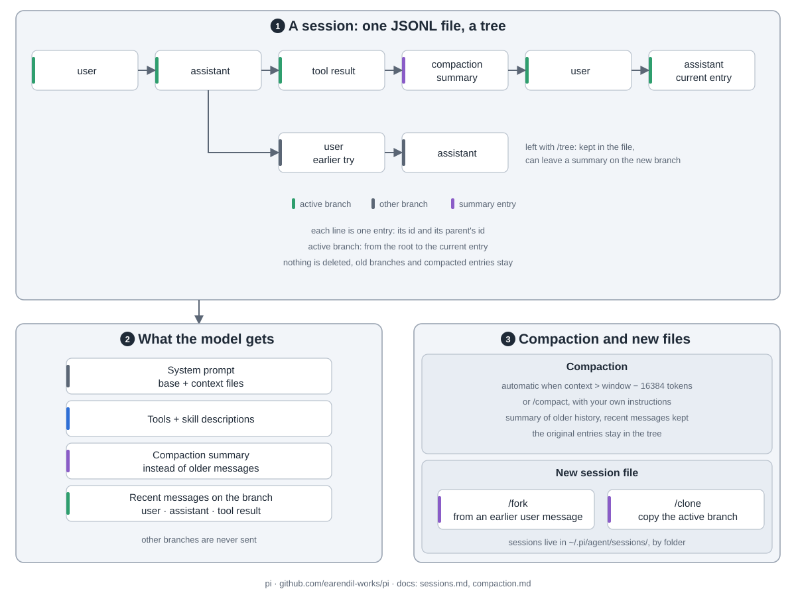

pi 是终端里的小巧编程智能体，只带四个工具，其余靠扩展自己加。

1. **入口**：终端界面、打印或 JSON 模式、JSONL RPC、TypeScript SDK，共用同一个智能体和会话。
2. **拼请求**：系统提示词加上下文文件、会话当前分支、工具（默认 `read`、`bash`、`edit`、`write`）、技能简介。技能全文用到才加载。扩展是同进程的 TypeScript 模块，能加工具、命令、厂商和界面，也能改上下文。
3. **循环**（`pi-agent-core`）：调模型，拿回文字和工具调用，执行工具（默认并行），记下结果，再来一轮。没有工具调用就结束。插话在这一轮后进去，追加消息等整次运行结束再进。
4. **pi-ai**：一套接口接多家厂商：Anthropic、OpenAI、Google、Bedrock、OpenRouter 或兼容 OpenAI 的服务。`/login` 填 key 或接订阅。

一个会话是一个 JSONL 文件。每条记录存父记录 id，所以是一棵树。只有当前分支，从根到当前记录，发给模型。`/tree` 跳回去另开分支，旧的还在。上下文快满时，压缩写一条摘要替掉旧消息，原记录仍在文件里。`/fork`、`/clone` 另开新文件。

pi 没有权限系统，工具用你的账号权限跑。要隔离就放进容器。
