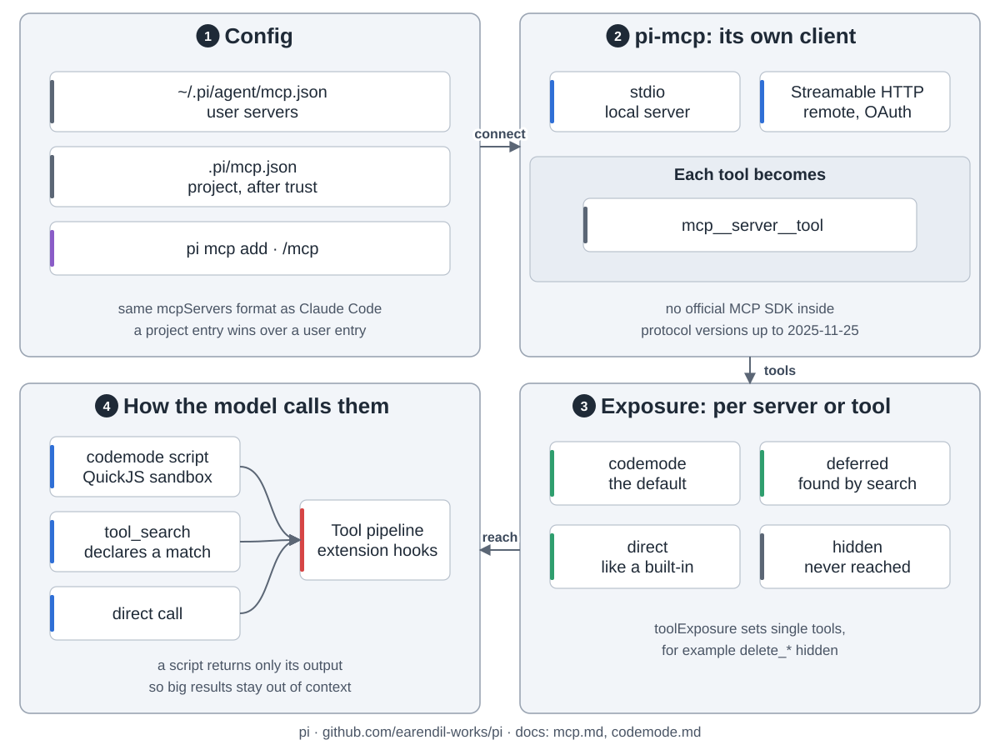

pi 是终端里的小编程智能体，只带四个工具，其余靠扩展加。

1. **入口**：终端界面、打印或 JSON 模式、JSONL RPC、TypeScript SDK，共用一个智能体和会话。
2. **拼请求**：系统提示词加上下文文件、会话当前分支、工具（默认 `read`、`bash`、`edit`、`write`）、技能简介。扩展是同进程的 TypeScript 模块，能加工具、命令和界面，也能改上下文。
3. **循环**（`pi-agent-core`）：调模型，拿回文字和工具调用，执行工具（默认并行），记下结果，再来一轮。没有工具调用就结束。
4. **pi-ai**：一套接口接多家厂商：Anthropic、OpenAI、Google、Bedrock、OpenRouter 或兼容 OpenAI 的服务。

会话是一个 JSONL 文件。每条记录存父记录 id，所以是一棵树。只有当前分支发给模型。`/tree` 跳回另开分支，旧的还在。上下文快满时，压缩写一条摘要替掉旧消息。`/fork`、`/clone` 另开新文件。

MCP 服务端写在 `mcp.json` 里。pi 用自己的客户端连，走 stdio 或 Streamable HTTP。默认模型看不到 MCP 工具，而是写沙箱脚本去调，只拿回输出。也可以用 `tool_search` 搜，或设成 direct 直接给。调用走内置工具那条管线。

pi 没有权限系统，工具用你的账号权限跑。要隔离就放进容器。
