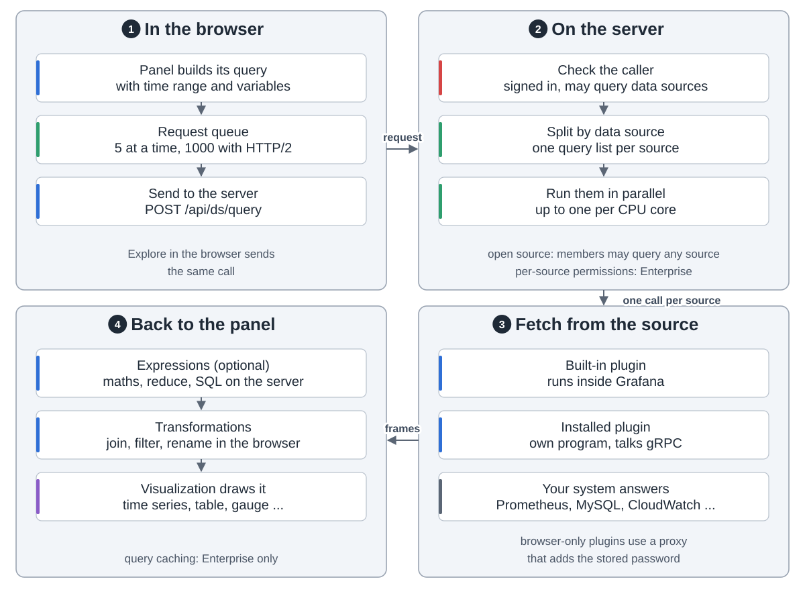
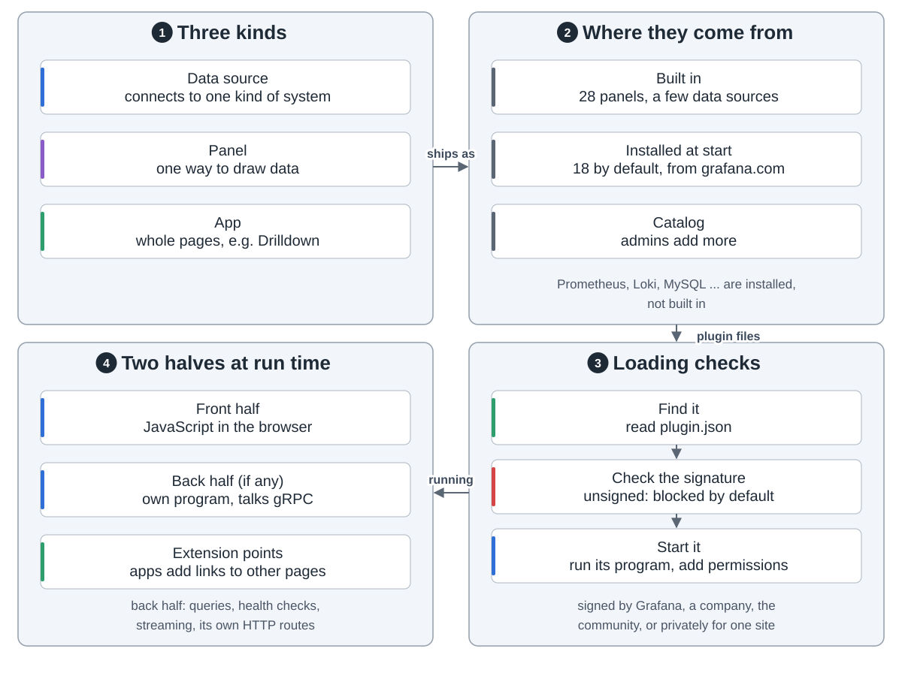
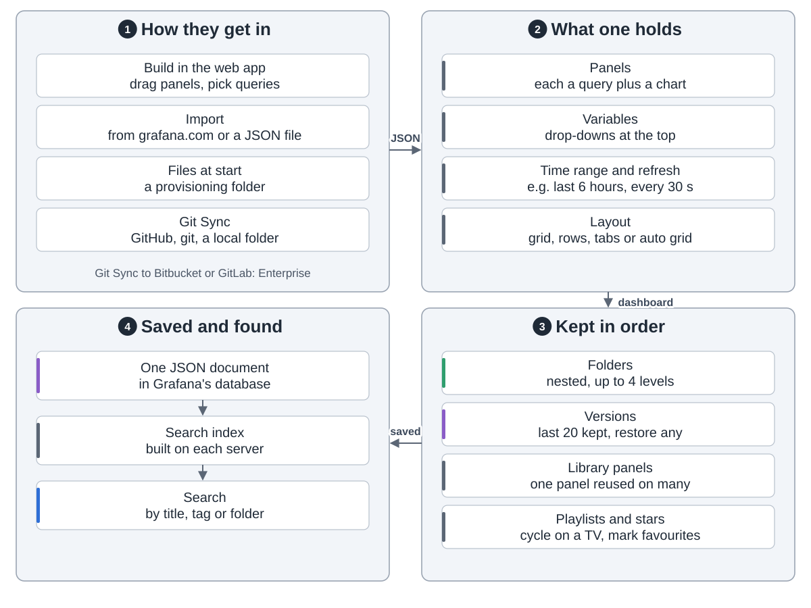
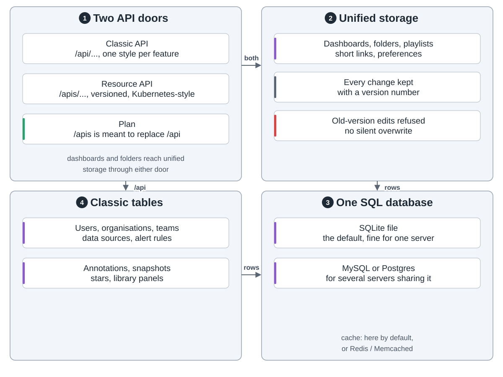
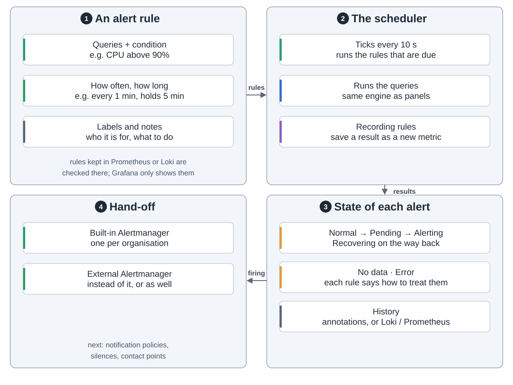
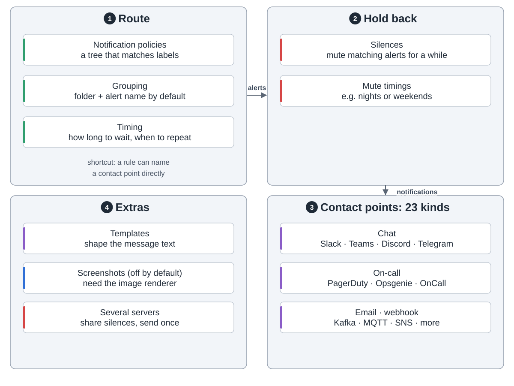
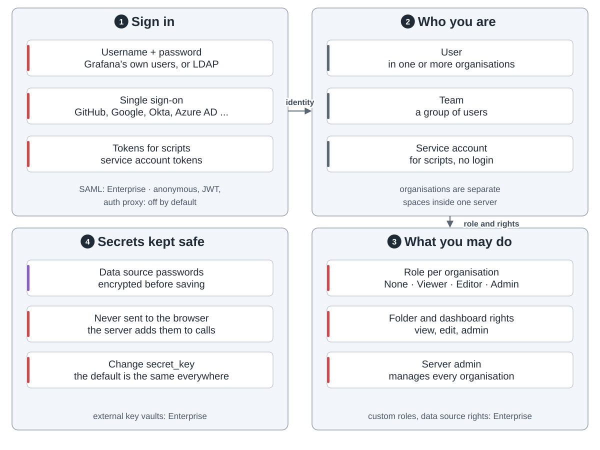
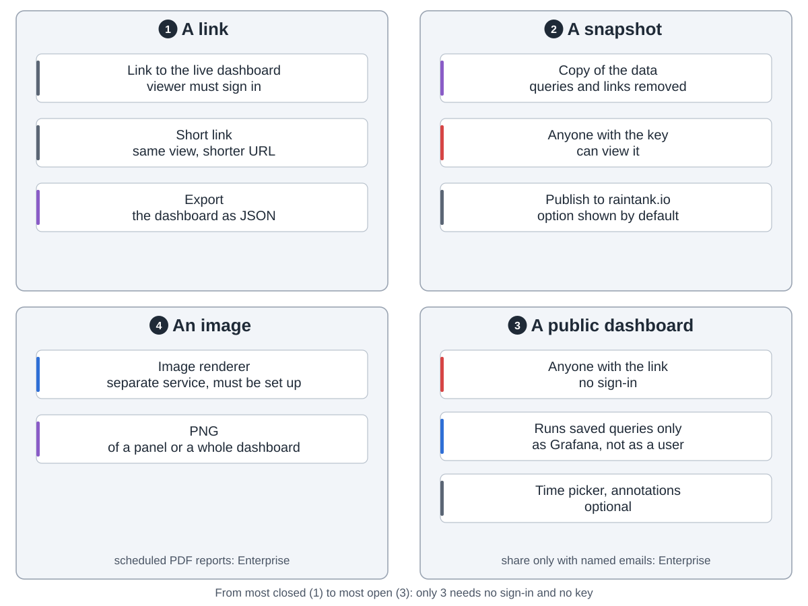
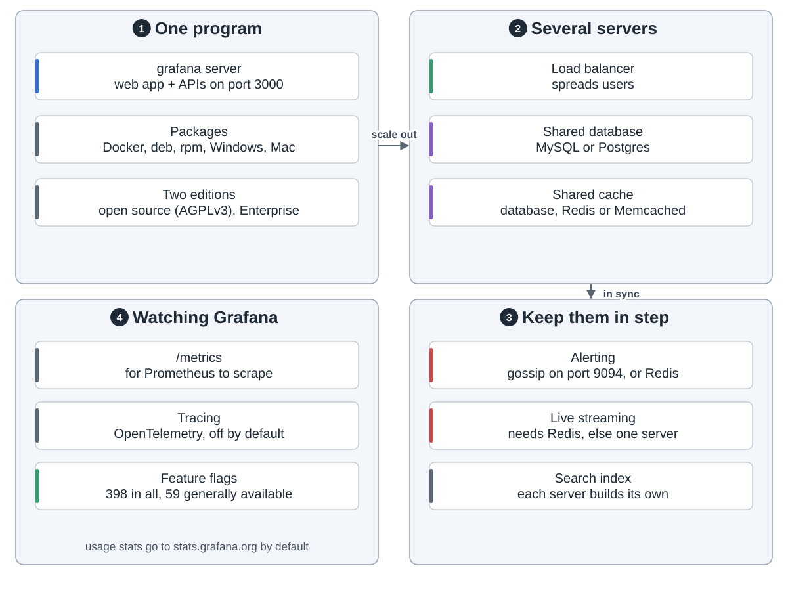

Grafana 画图、发告警，数据在你的系统里。每次打开面板，它都去问那些系统。

**一个程序。** 服务器提供网页和接口，检查每个请求，存仪表盘和规则，替面板查数据。

**面板的数据。** 服务器核对身份，按数据源拆开并行去问，结果以数据帧返回。

**插件。** 数据源、面板、应用都是插件。大多数数据源是启动时装的，不内置。没签名的默认不加载。

**仪表盘**是一份 JSON，可以在网页里画，也可以从文件或 Git 加载。

**存储。** 自己的库默认是 SQLite 文件，也可用 MySQL 或 Postgres。仪表盘已改用库里带版本号的新存储。

**告警。** 调度器每 10 秒跑到点的规则，触发的告警交给内置 Alertmanager。

它分组、静默，再发到 23 种联系点。

**访问。** 用密码、LDAP 或单点登录进来，每个组织一个角色。SAML 和自定义角色是企业版。

**分享。** 链接要登录，快照是数据副本，公开仪表盘有链接就能看，只跑存好的查询。

**运行。** 一台起步；扩容就在负载均衡后多跑几台，共享 MySQL 或 Postgres。

