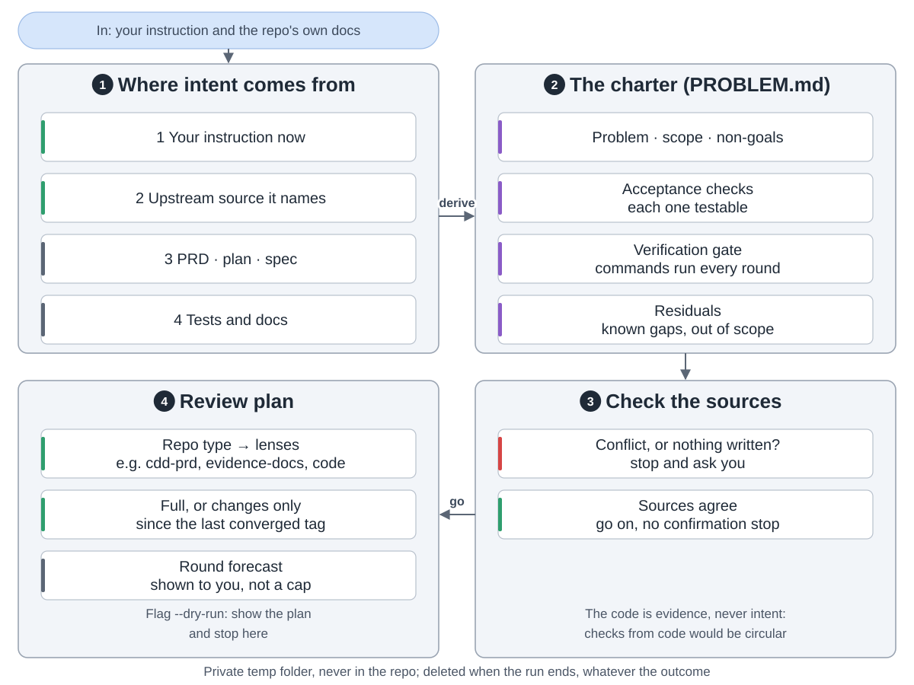
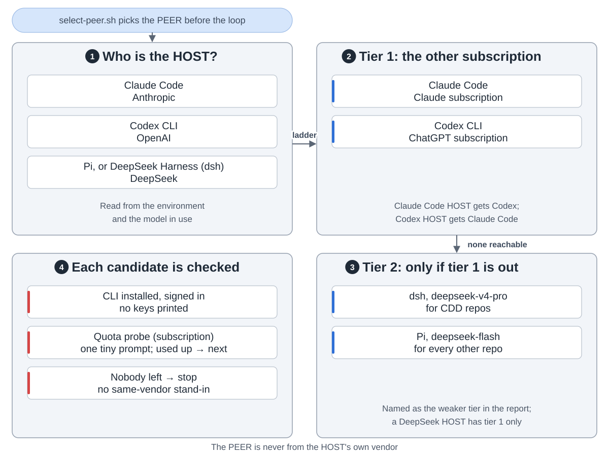
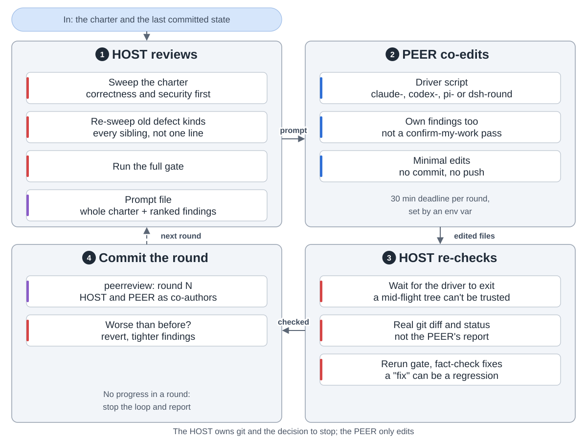
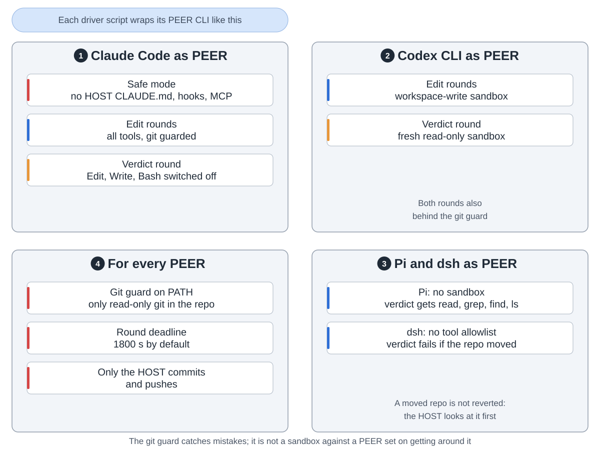
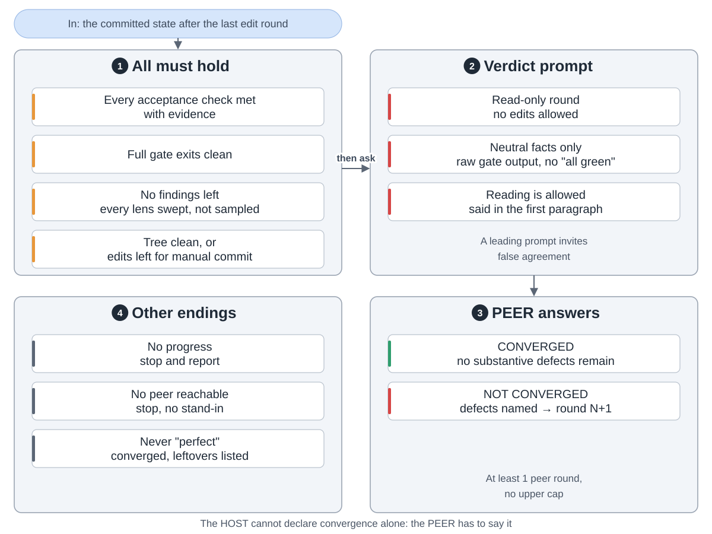
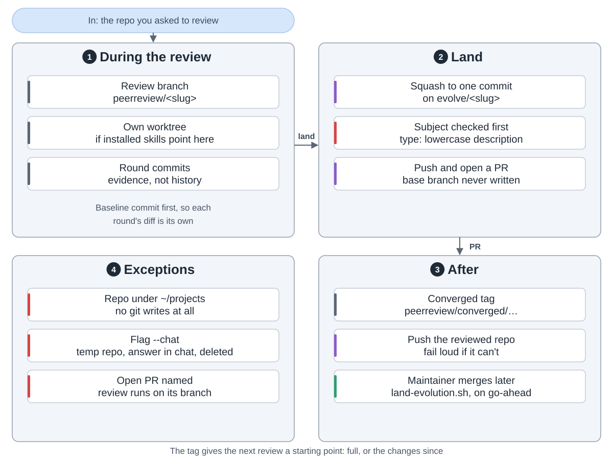
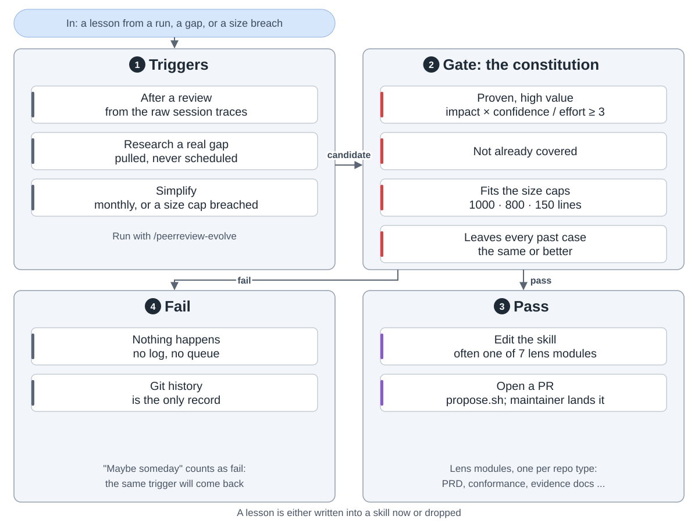

peerreview is a skill that has two AI models from different vendors check a repo together. The HOST reviews and owns git. The PEER, from the other vendor, edits files. They loop until both agree the repo does what it claims.

**The charter.** Each run first writes down what "done" means, from your instruction and the repo's own docs. It lives in a temp folder, never in the repo. If the docs conflict or say nothing, it stops and asks.

**The peer.** Claude Code and the Codex CLI review each other. DeepSeek is a fallback, used only when the other of those two is unreachable, and the report says so.

**One round.** The HOST reviews and runs the checks, the PEER fixes, the HOST reads the real diff, reruns the checks and commits.

**Guard rails.** Each PEER runs behind a git guard and a 30-minute deadline. In the verdict round edits are blocked; dsh can't block them, so its round fails if the tree moved.

**When to stop.** Every check passes and the PEER says CONVERGED to a neutral prompt. At least one peer round always runs; there is no upper limit. A round with no progress stops the loop.

**Landing.** Rounds are squashed into one commit and opened as a pull request. A tag marks the reviewed commit, so the next run can start from it. Repos under `~/projects` get no git writes; the `--chat` flag reviews an idea in a temp repo.

**Getting better.** `/peerreview-evolve` turns lessons into skill edits, but only if they pass the constitution. Anything else is dropped, not logged.

