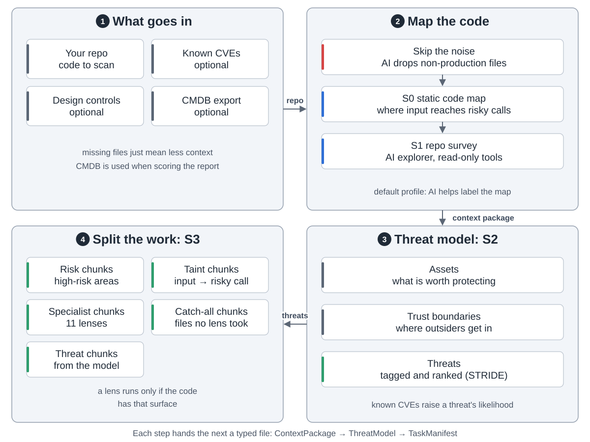
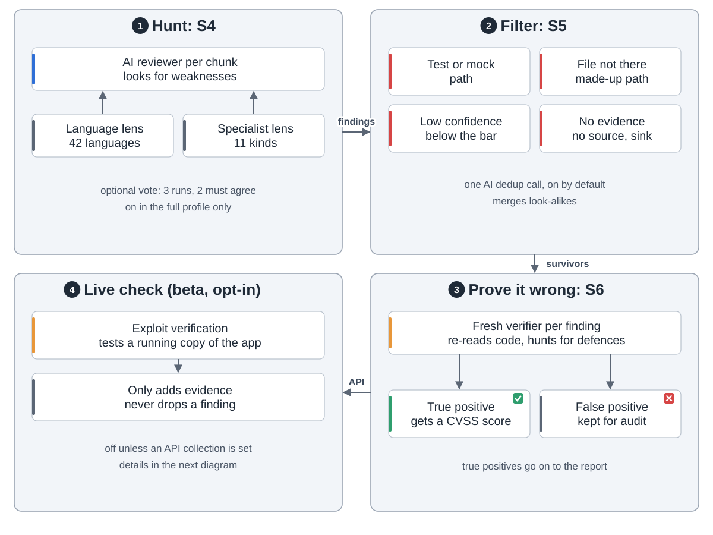
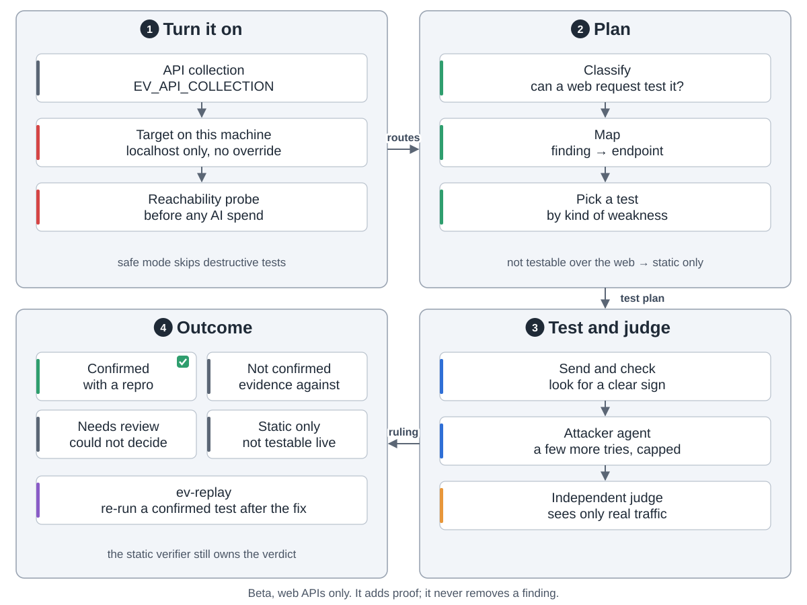
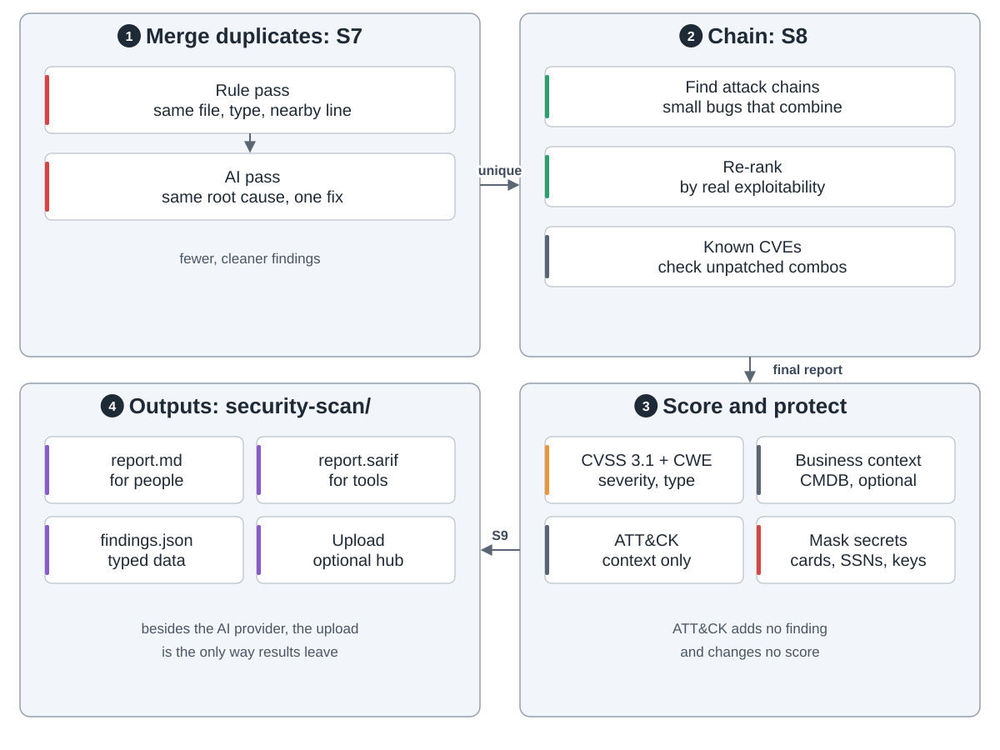
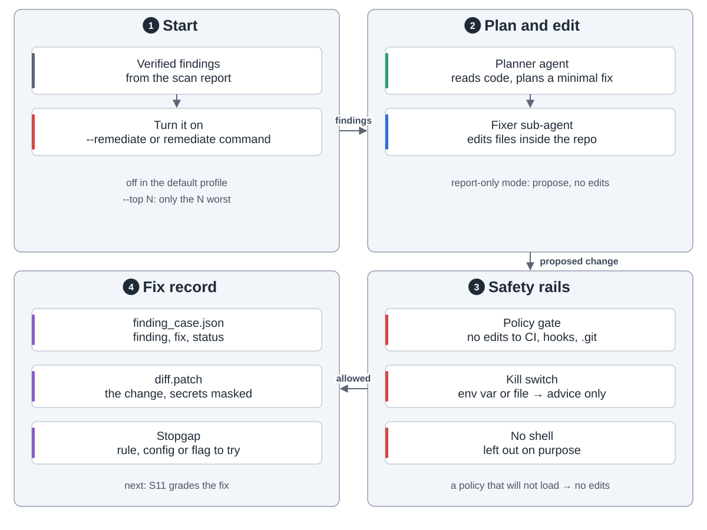
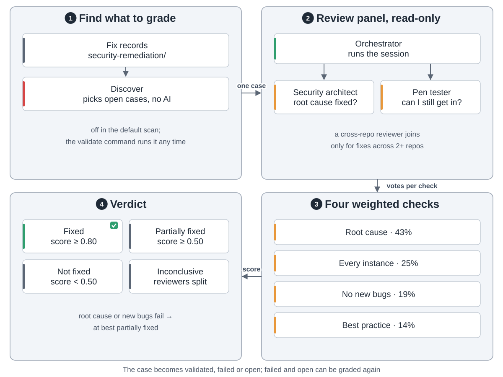
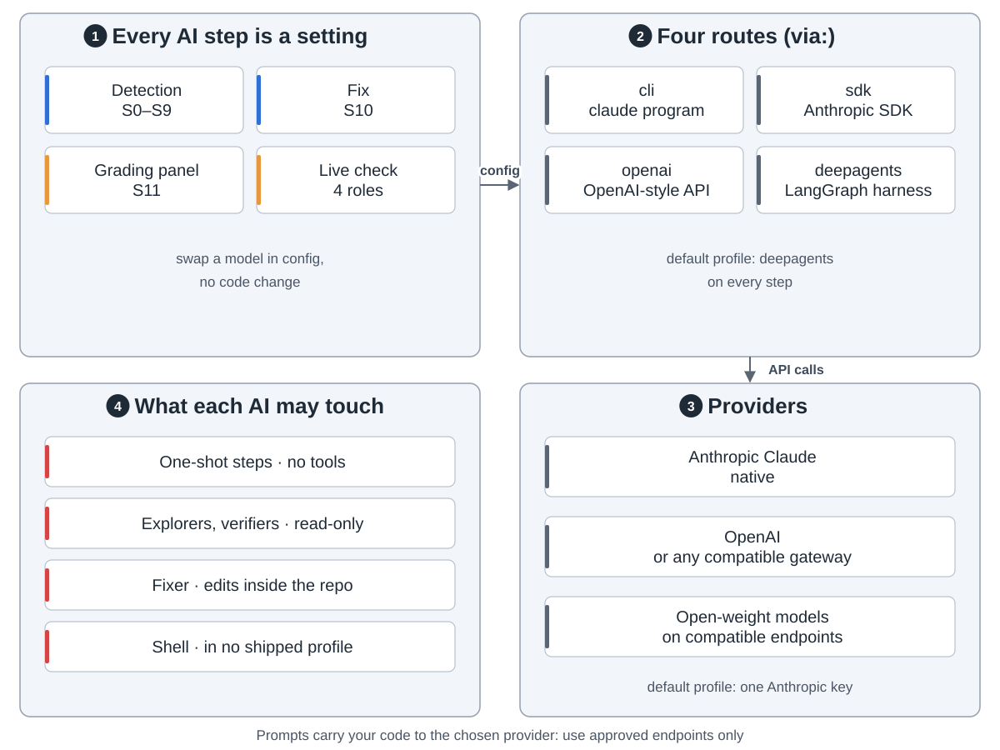
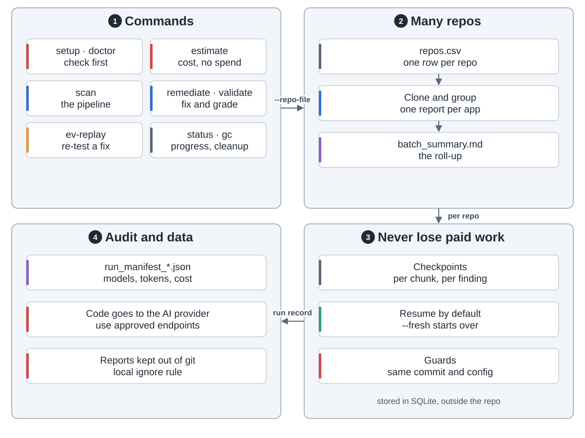

VVAH is Visa's open-source harness that uses AI models to find security weaknesses in code, propose fixes and grade them. This is a community fork. Every finding is a lead for a person to check, not a final answer.

**1. Find where to look.** An AI pass skips non-production files. S0 maps where input reaches risky calls, S1 surveys the repo, S2 builds a threat model, and S3 splits the code into chunks.

**2. Hunt and double-check.** In S4 an AI reviewer reads each chunk. Specialist chunks get one of 11 lenses, such as access control. S5 drops obvious mistakes with plain rules. In S6 a fresh verifier tries to prove each finding wrong. Only true positives go on.

An optional live check (beta) tests web-API findings against a copy of the app on the same machine. A separate judge decides from the real traffic. It adds proof and never removes a finding.

**3. Report.** S7 merges duplicates. S8 links small bugs into attack chains and re-ranks them. S9 writes Markdown for people and SARIF for tools, with secrets masked.

**4. Fix and grade.** Both are off in the default profile. S10 proposes a minimal fix, behind a policy gate and a kill switch.

In S11 two AI reviewers grade the fix on four weighted checks. Root cause counts most.

Each step picks its own model and route in config: Claude, OpenAI or open-weight models. The default profile needs one Anthropic key.

Runs save progress as they go, so a crash loses little paid work. Each run records its models, tokens and cost.

