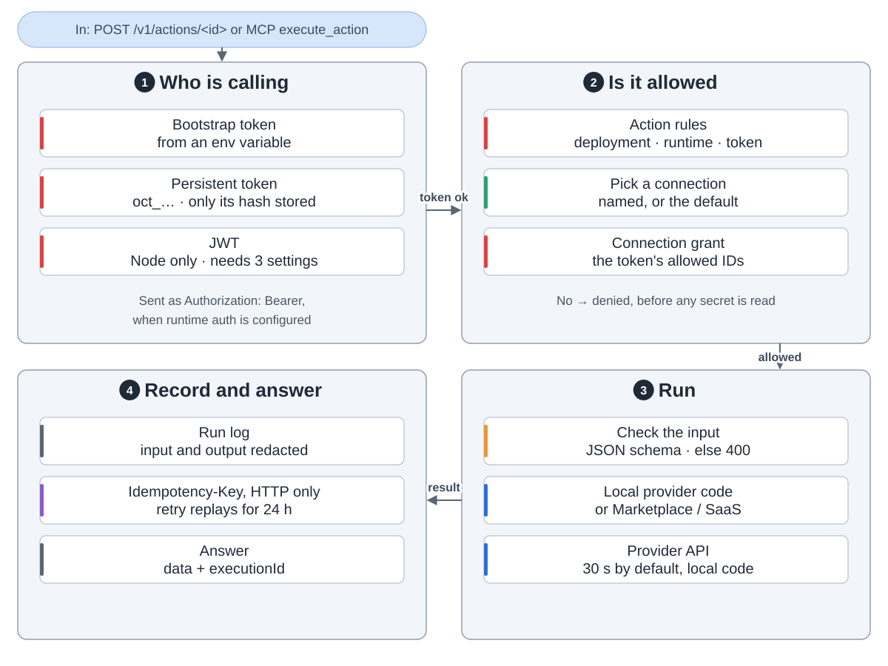
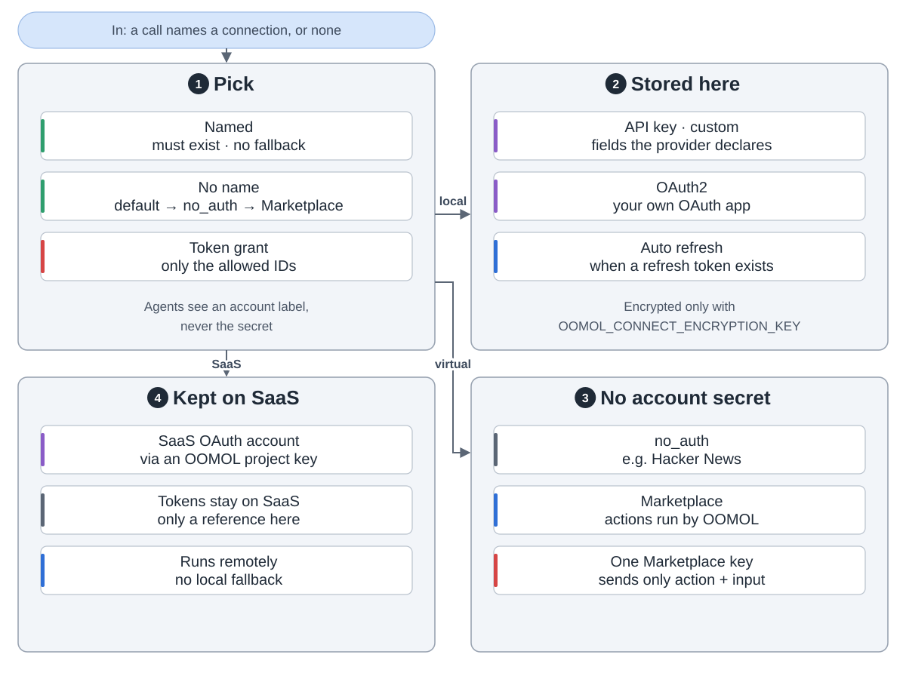
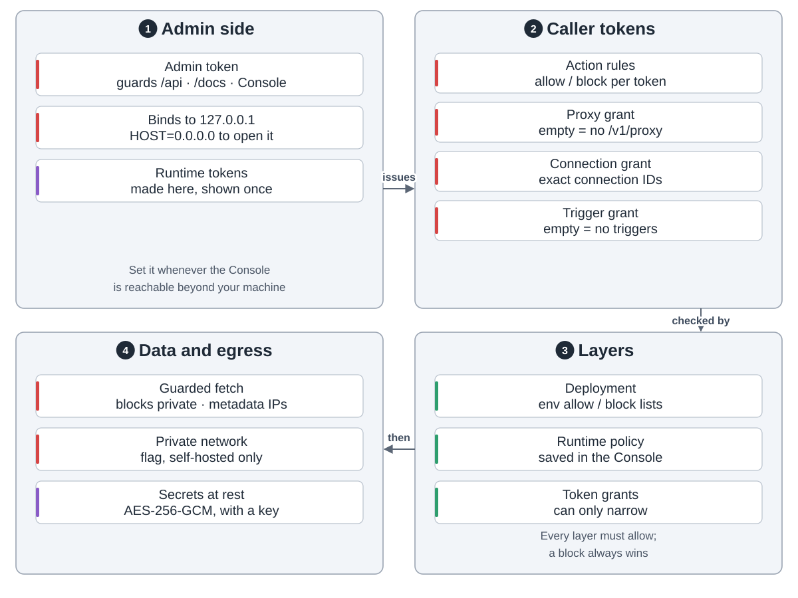
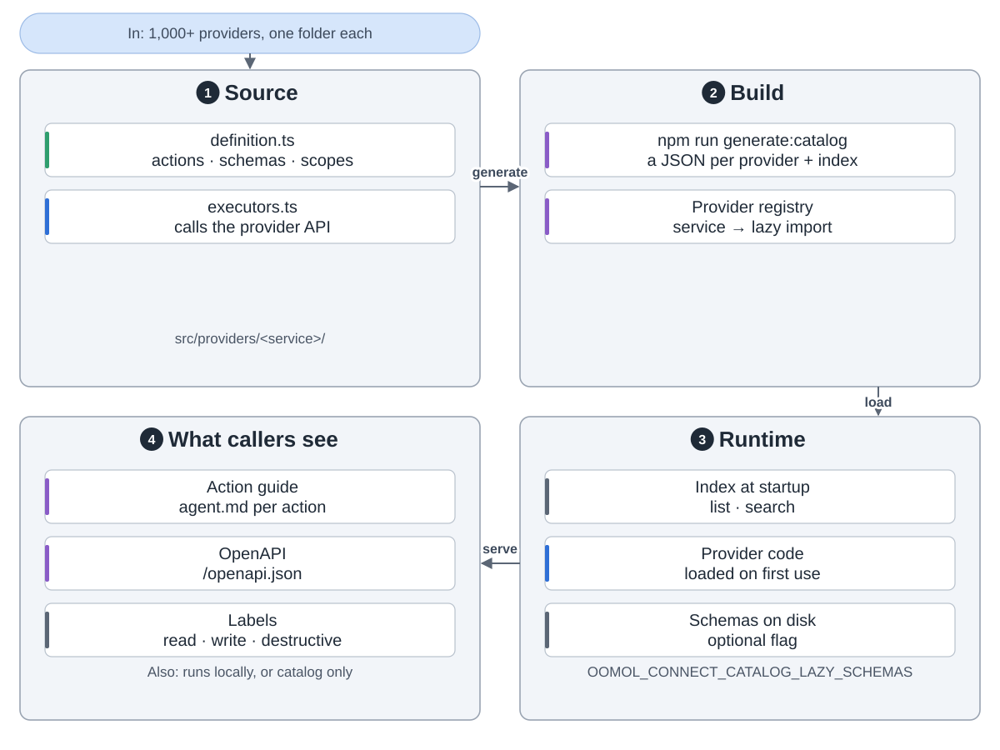
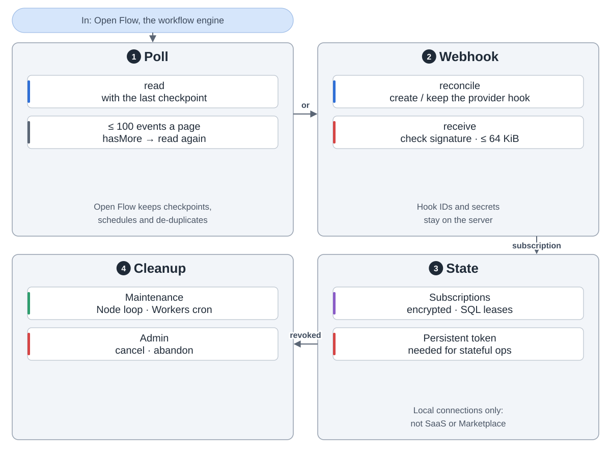
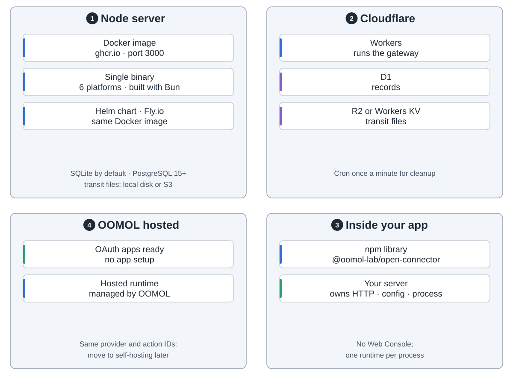

OpenConnector is an open-source gateway between AI agents and the apps you use. You connect an account once. Agents then run ready-made actions on it, but never see its password or token.

**One call** comes in through MCP, the HTTP API or the Web Console. The gateway checks the token and the allow and block rules, picks the account, checks the input, runs the provider's code and writes a redacted log.

**Connections.** API keys and OAuth tokens are stored in the gateway's database, encrypted only when you set an encryption key. Some providers need no account. Marketplace actions run at OOMOL with one key. A SaaS OAuth account keeps its tokens at OOMOL.

**Safety rails.** An admin token guards the console. Each caller token carries its own grants. Every layer must allow a call, and a block always wins. Requests can't reach private addresses unless you turn on a flag.

**The catalog.** Each provider is one folder: a definition and the code that calls its API. A script turns the definitions into the catalog. The code loads only the first time it is used.

**Triggers** pass provider events to Open Flow, a separate workflow engine, by polling or by webhook.

**Where it runs:** a Node server (Docker, one binary, Helm), Cloudflare Workers, a library inside your app, or OOMOL's hosted service.

