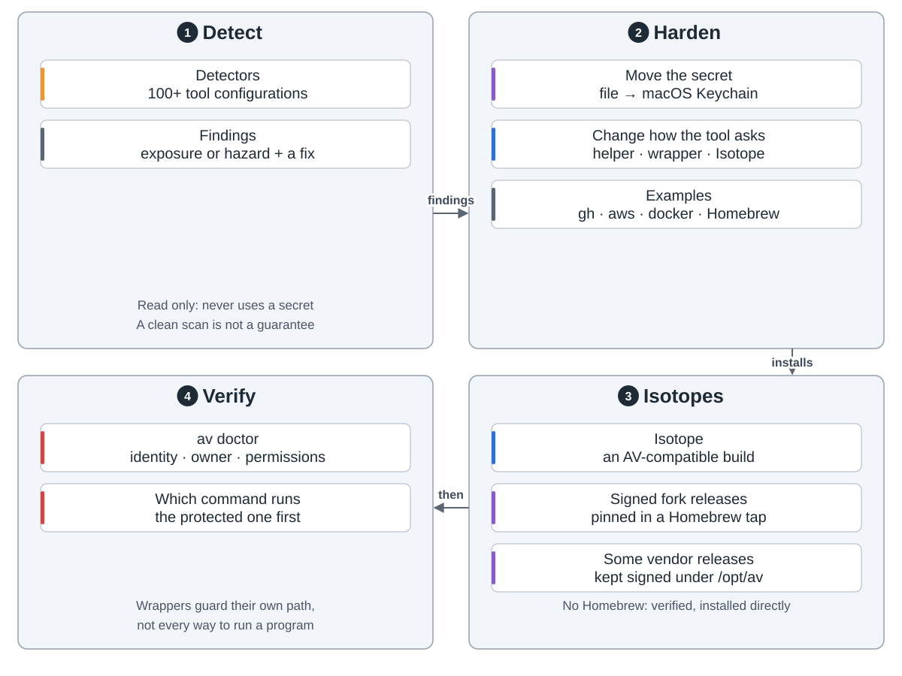
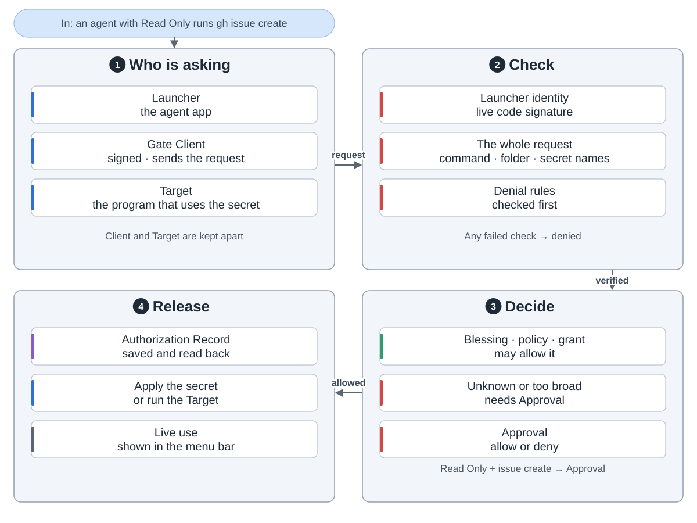
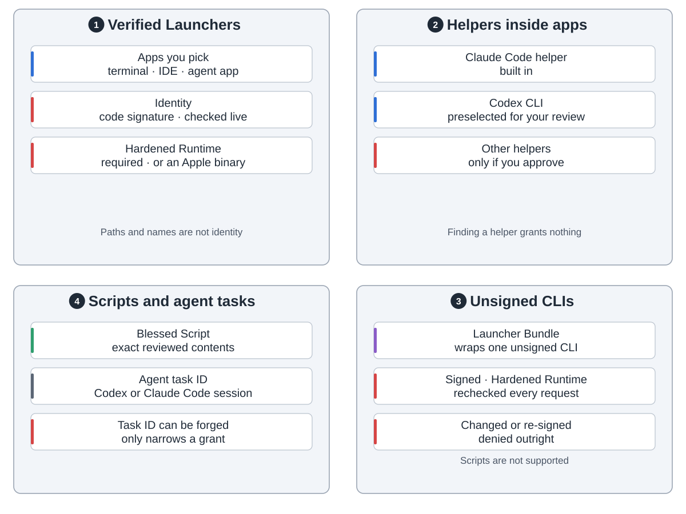
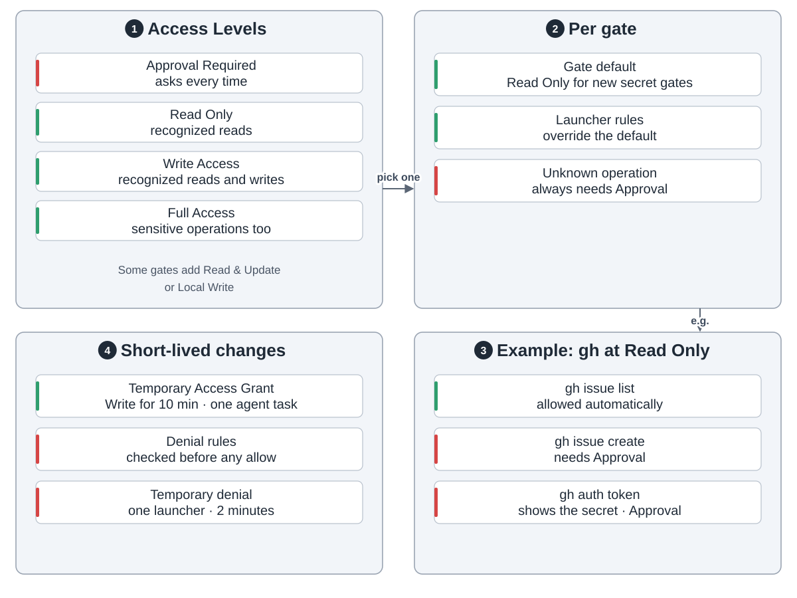
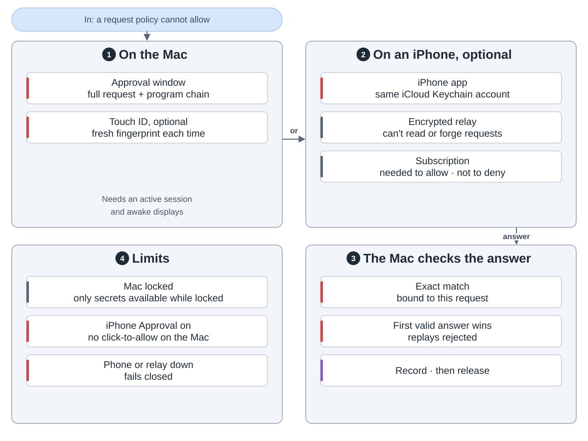
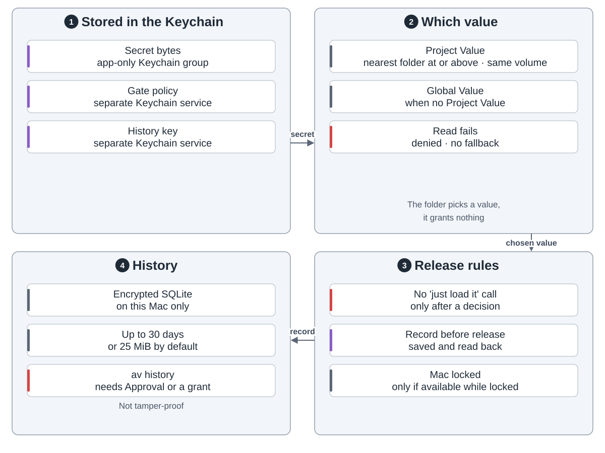
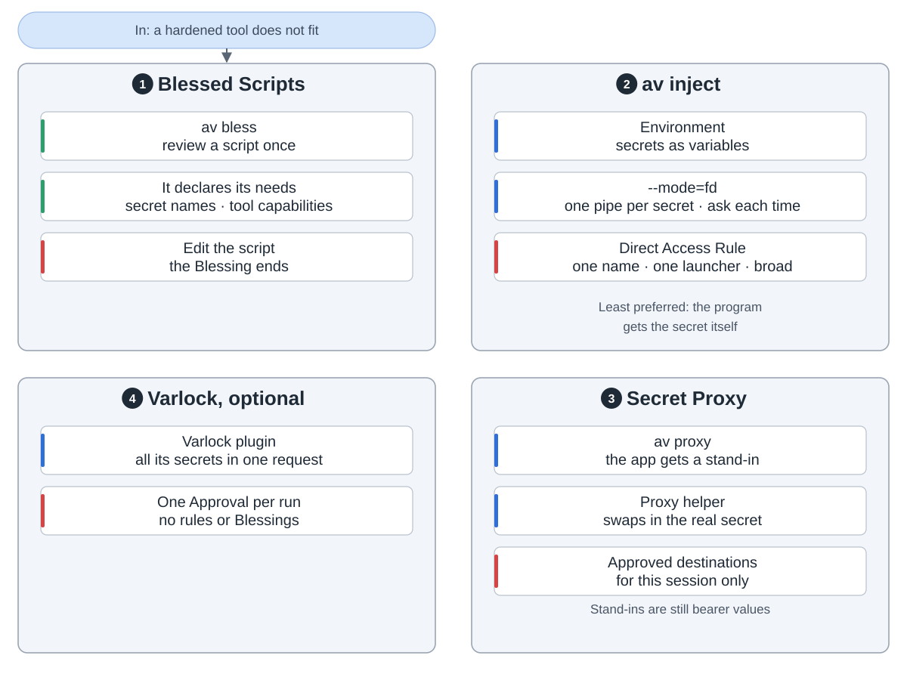
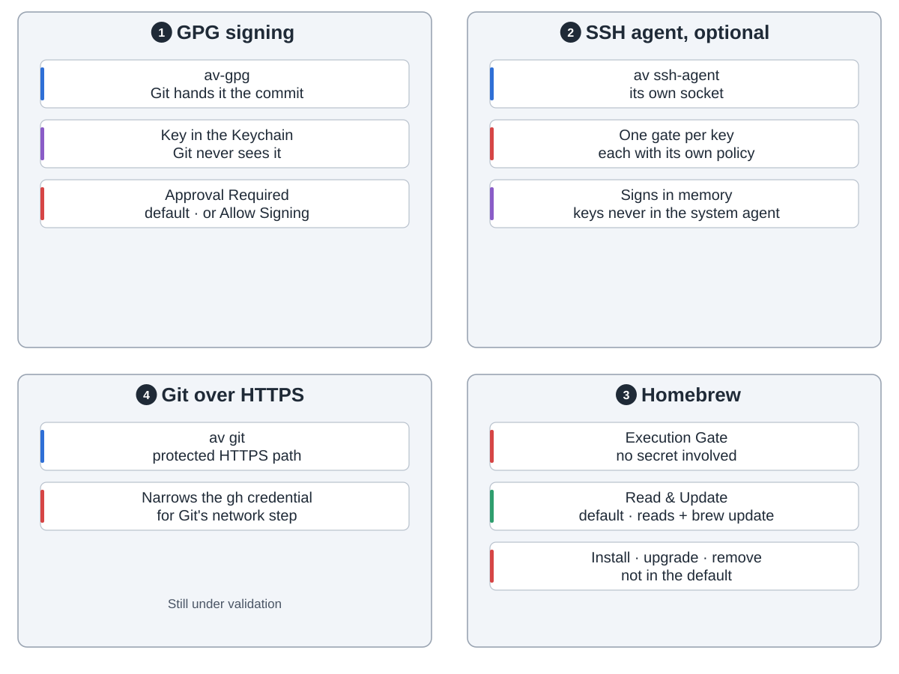
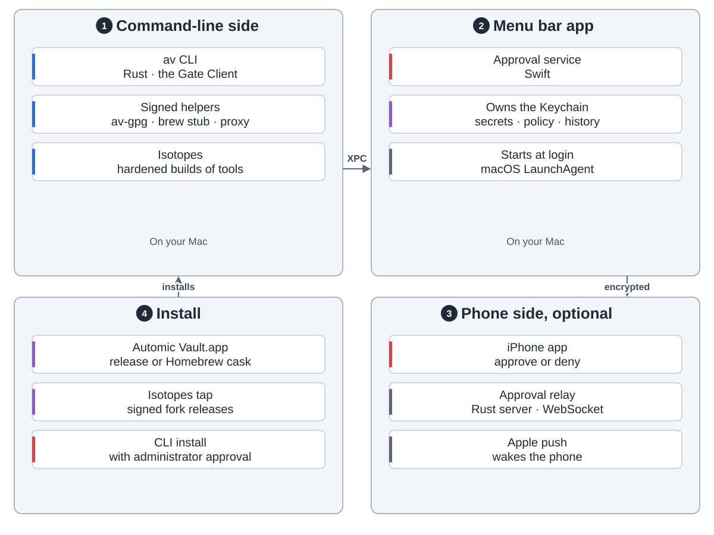

Automic Vault 在 Mac 上保管开发者的凭据。它把令牌从文件挪进钥匙串。之后，你或 AI 智能体要用凭据的命令，都先过一道检查。

**设置。** `av scan` 找出暴露的凭据。`av harden` 把它们挪走，并改掉工具取凭据的方式。`av doctor` 检查结果。

**一次请求。** Mac 先查谁在要、整条命令是什么。规则可以直接放行，否则由你批准或拒绝。先存好记录，密钥才放出去。

**谁在要。** 身份看应用的代码签名，每次请求都现场检查。没签名的命令行工具可以套一个 Launcher Bundle。

**访问规则。** 每个工具的闸门有几档访问级别。文档建议给智能体只读。没见过的命令永远要问。

**批准**可以在 Mac 上点，用 Touch ID，或者在 iPhone 上。Mac 核对每个回答。

**密钥和记录。** 密钥留在钥匙串里。每次使用都加密记在这台 Mac 上，最多保留 30 天，还有大小上限。

**其他用法：** 审过的脚本、`av inject`、Secret Proxy 和 Varlock。

**签名、SSH 和 Homebrew** 各有自己的闸门。

**组成部分：** `av` 命令和几个小助手、一个掌管钥匙串的菜单栏应用，以及可选的 iPhone 应用和中继。

