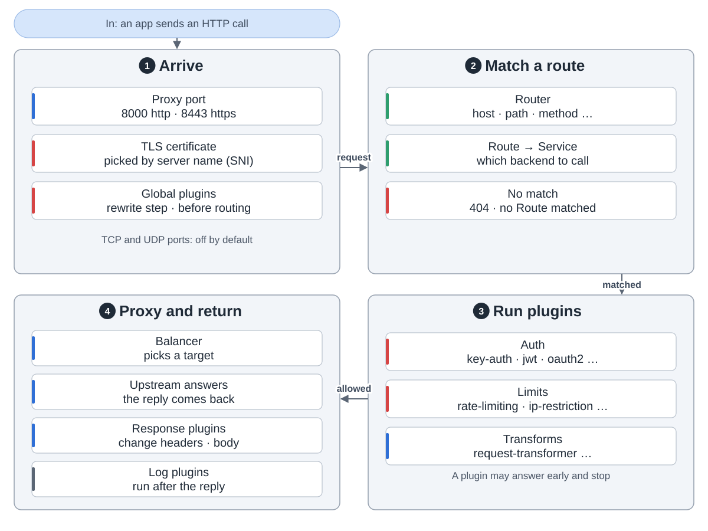
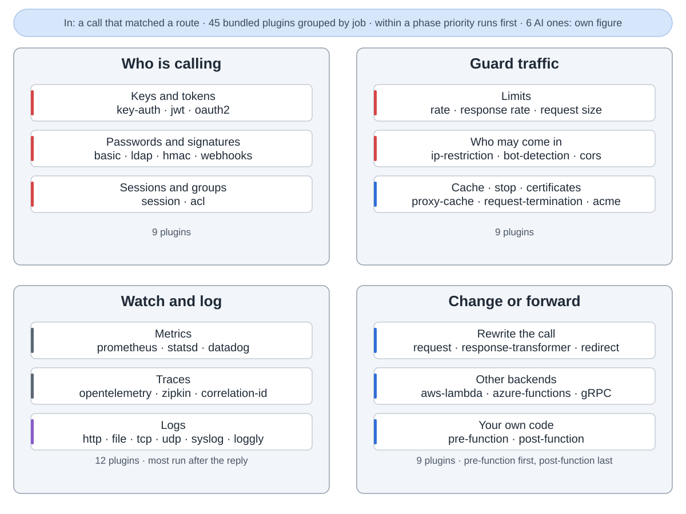
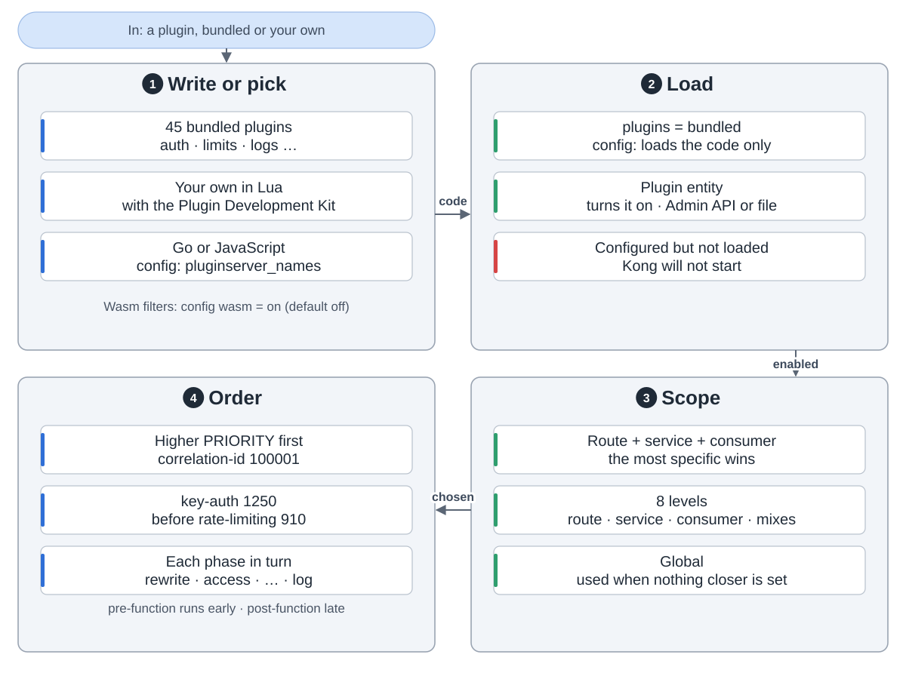
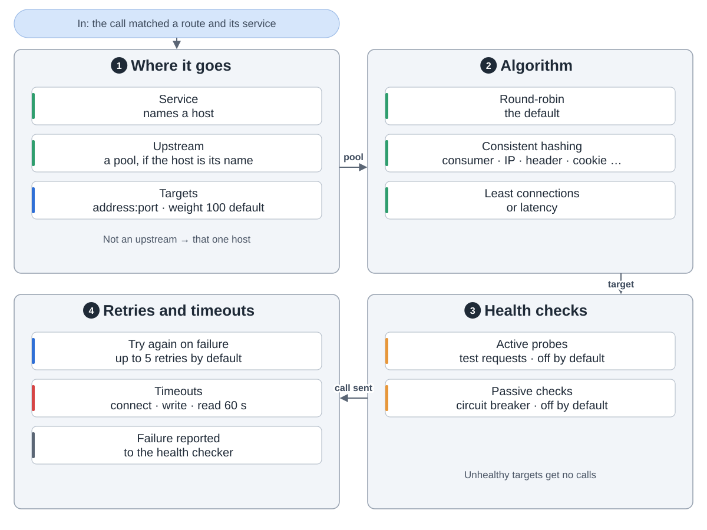
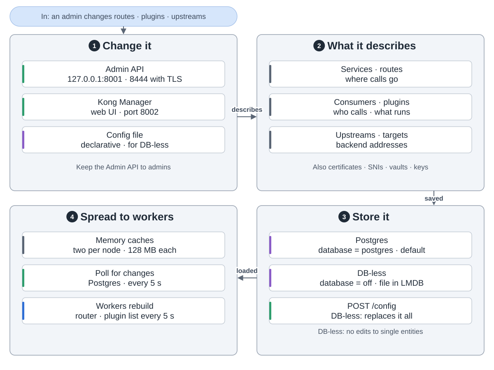
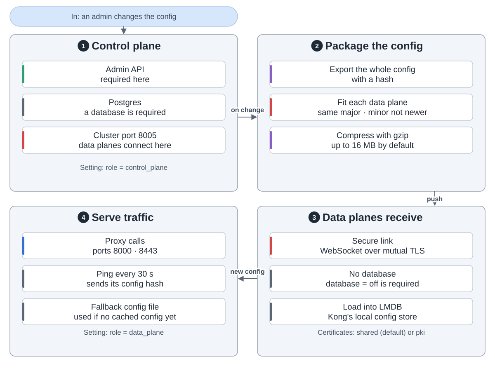
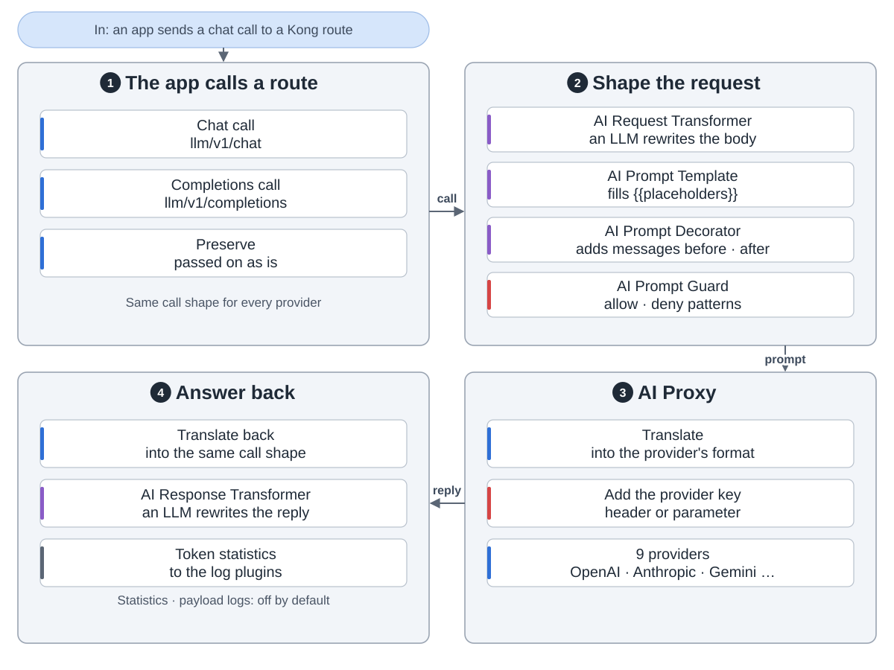
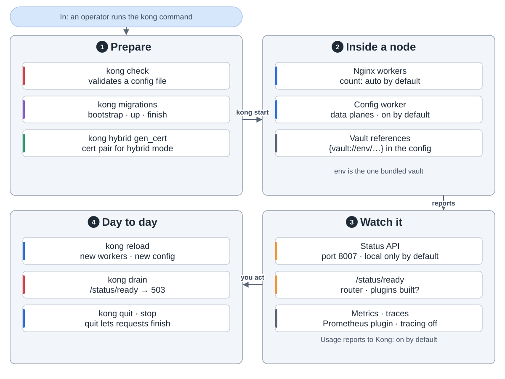

Kong 是基于 Nginx 的开源 API 网关。应用调用 Kong，Kong 把每次调用转给对的后端。途中可以认出调用方、限流、记日志。

**一次调用。** Kong 匹配一条路由，运行它的插件，挑一个后端，再把回复送回去。匹配不到路由就回 404。

**插件**干大部分活。自带 45 个：认证、限流、改写、日志和指标。

**插件规则。** 加载插件不等于开启。开启后，最具体的设置生效，优先级高的先跑。也可以自己写：用 Lua，或通过插件服务器用 Go、JavaScript。

**选后端。** upstream 把调用分给多个目标，默认轮询。健康检查要自己开。调用失败会重试，默认最多 5 次。

**配置**经 Admin API、Kong Manager 或文件写入。存在 Postgres 里，或不用数据库，放在内存里（DB-less）。

**混合模式**（设置项 `role`）把活分开。控制面管数据库，把整份配置推给数据面，数据面处理流量。

**AI 插件**让 Kong 接在 LLM 前面。AI Proxy 用一种调用形状，翻译给 9 家提供方。token 日志默认关闭。

**运行。** `kong` 命令负责准备、启动、重载和摘流一个节点。8007 端口的 Status API 报告健康状态和指标。

