midPoint is an open-source identity governance and administration (IGA) system. It reads who works here from HR, works out what each person should have, and keeps every account in line.

**Parts.** The GUI, the REST API and your own code all call one Model API. Every change goes through the model. Data lives in PostgreSQL.

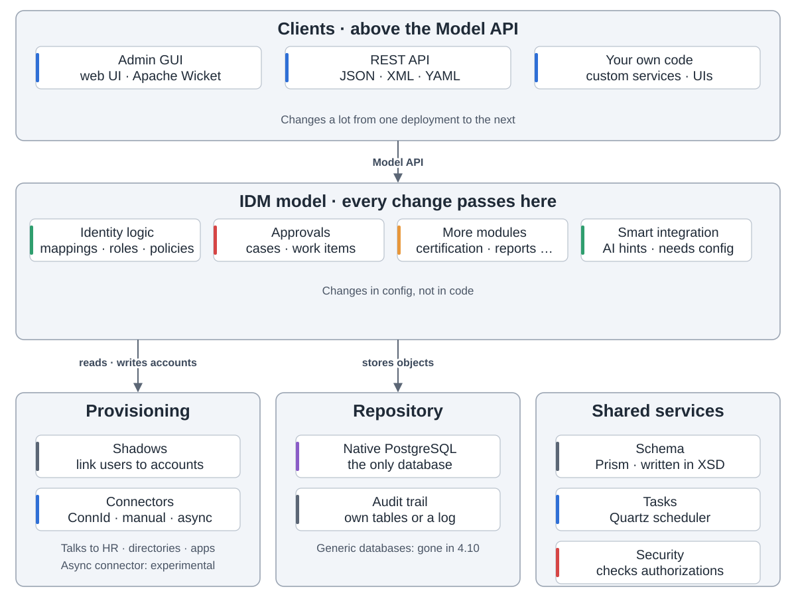

**Sync.** Live sync, reconciliation and import bring account changes in. midPoint finds each account's owner, names the situation and reacts. When it can't tell, a person decides.

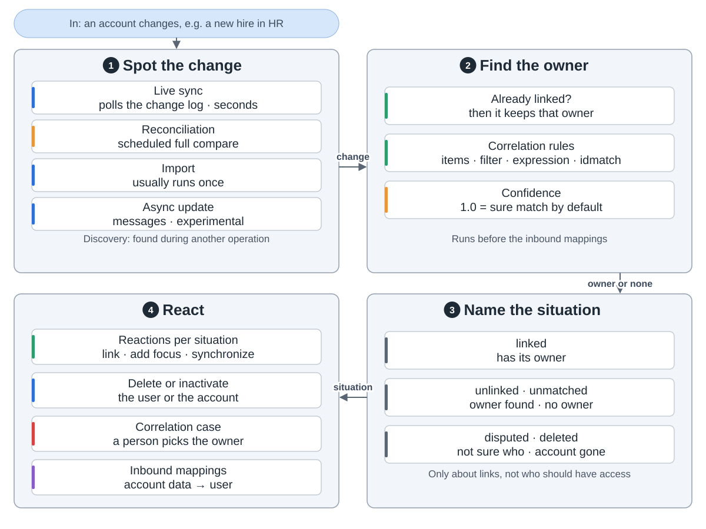

**One change.** The clockwork first works out what the user and each account should look like. Rules and approvals check that, and only then is it written out.

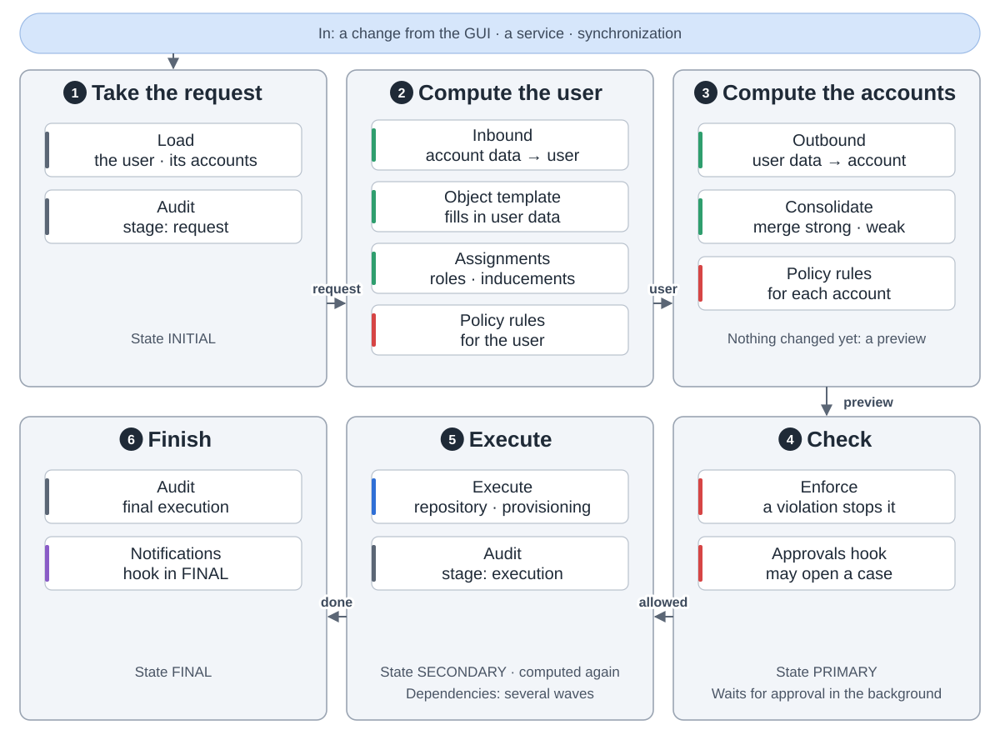

**Roles.** A user asks for a role or gets one by rule. A business role pulls in application roles, and those make the accounts and groups.

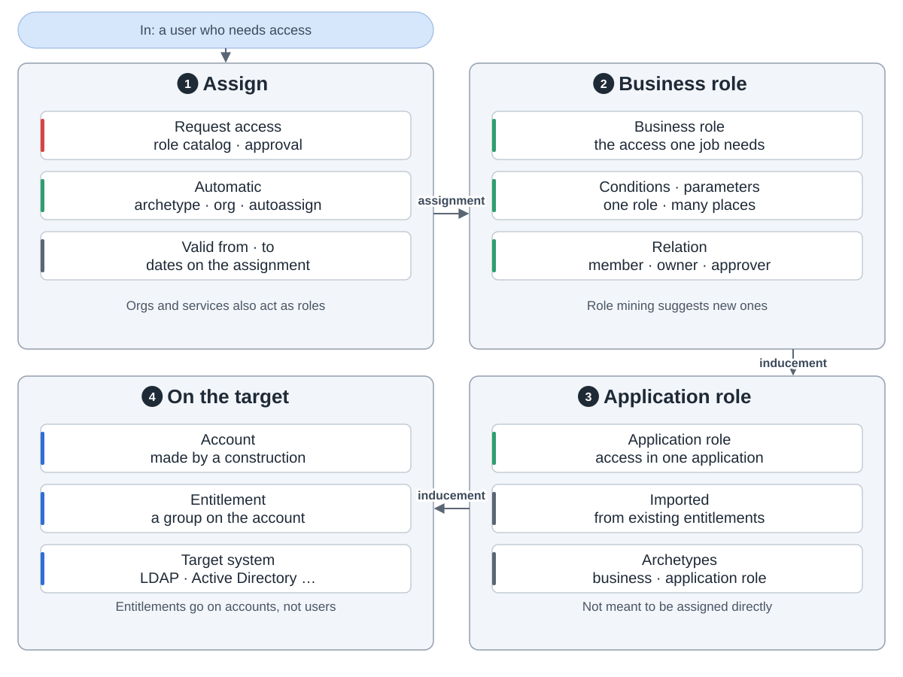

**Policy rules** pair a condition, such as two roles that must not go together, with an action: block, ask for approval, or mark it for a report.

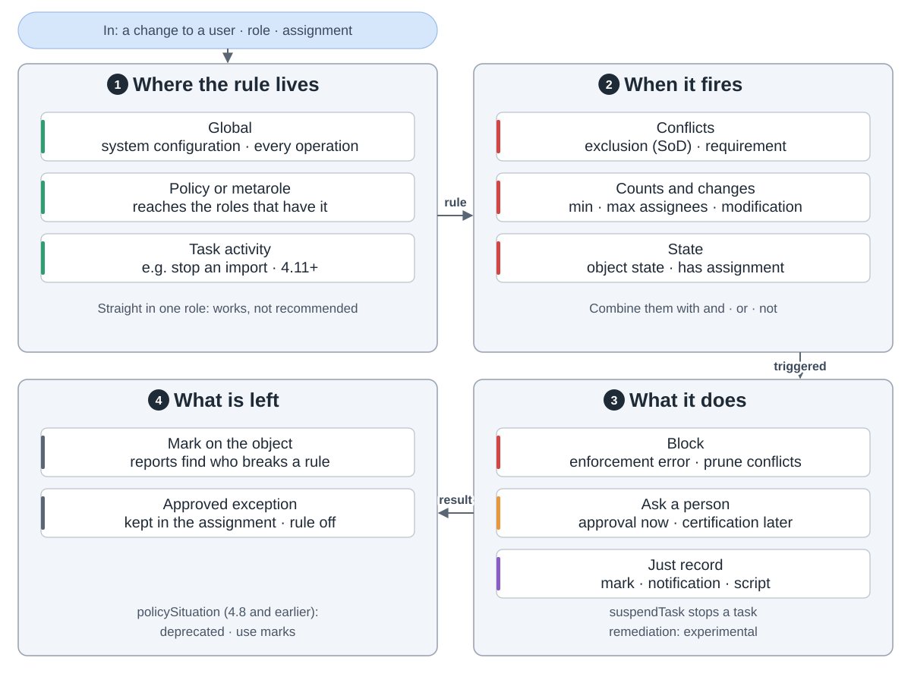

**Approvals.** A request is just the change itself. Rules decide who approves, in stages. Deputies can stand in, and a deadline can escalate.

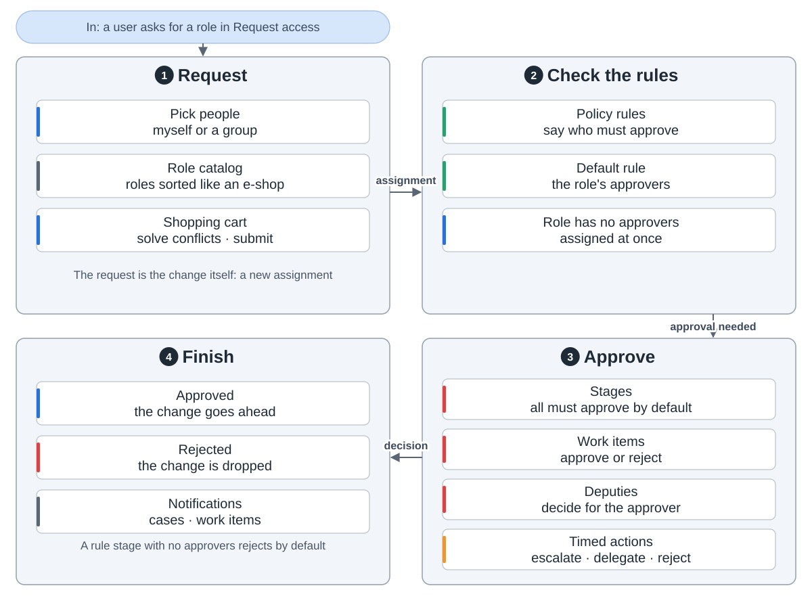

**Certification** asks managers or role owners to confirm or revoke access. Revoked access is removed only if remediation is set to automated.

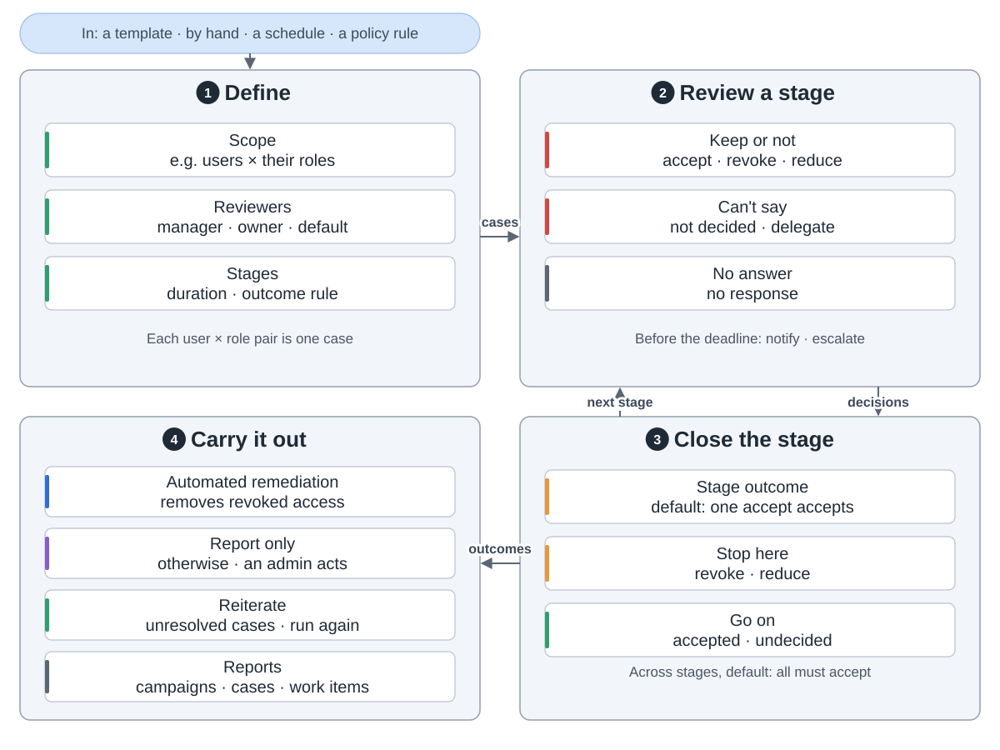

**Provisioning** writes through a connector, or opens a case for a person. A change that can't go through waits in the shadow and is retried.

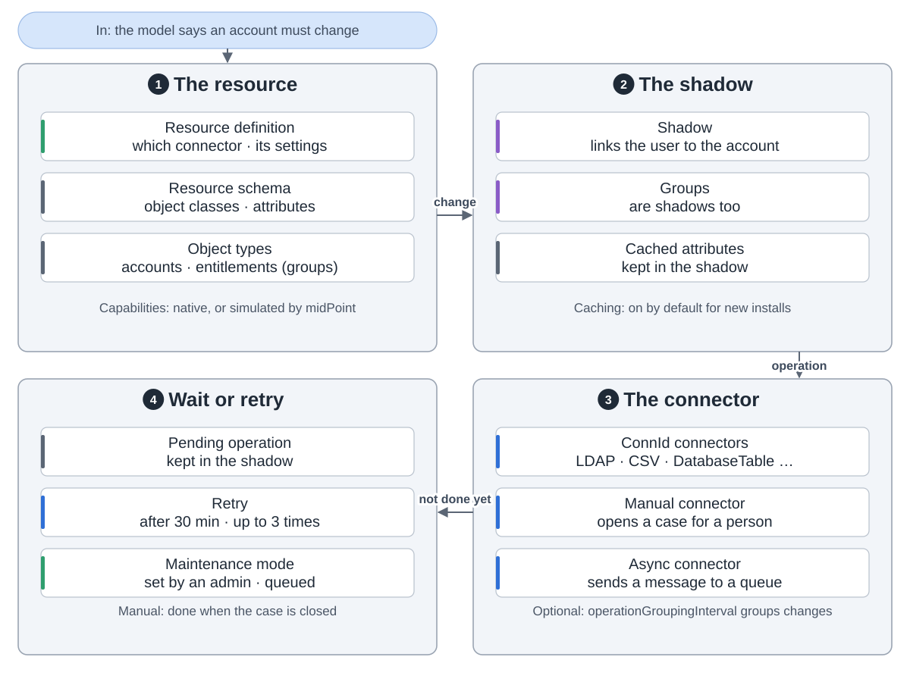

**Security.** You sign in through modules picked per channel. Anything not allowed is denied. Every change lands in the audit trail.

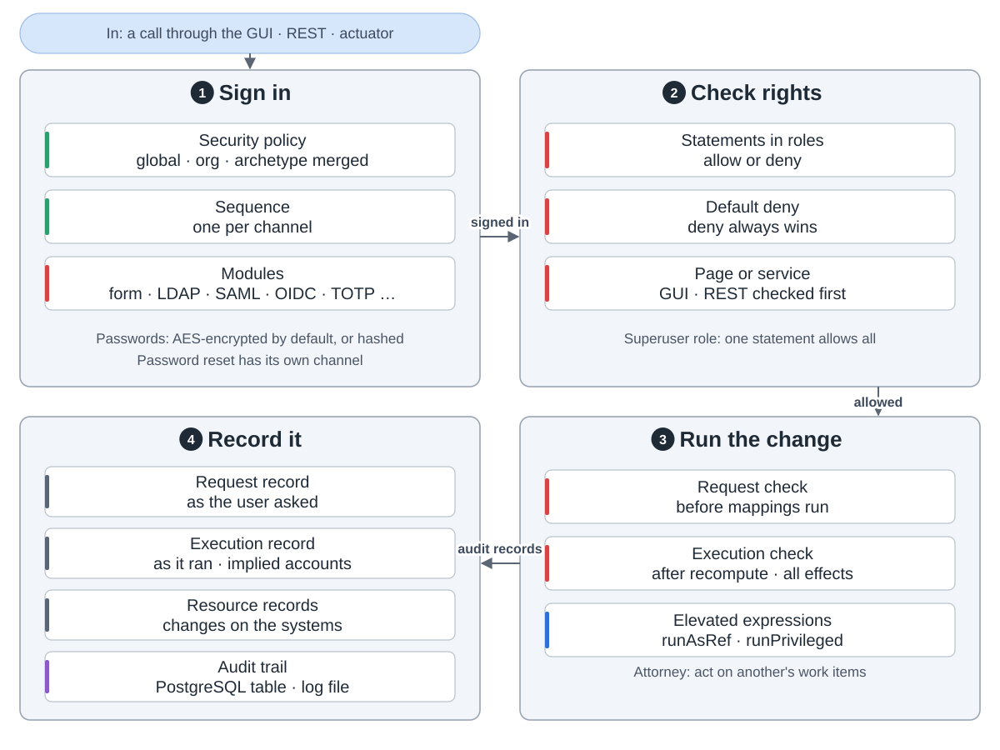

**Simulations** let you try a config change in preview mode before you switch it on.

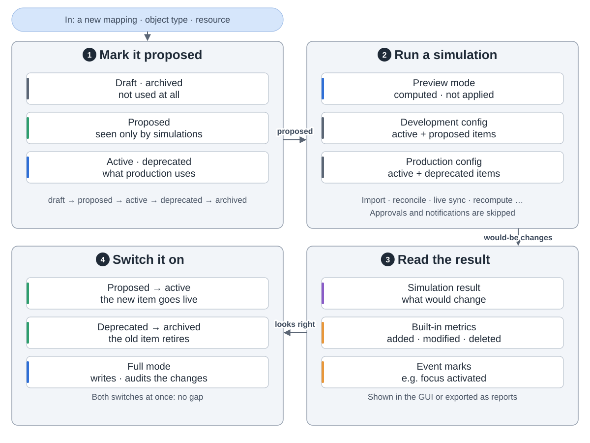

**Running it.** One Java server on port 8080. Set `clustered` to true and several nodes share one repository.

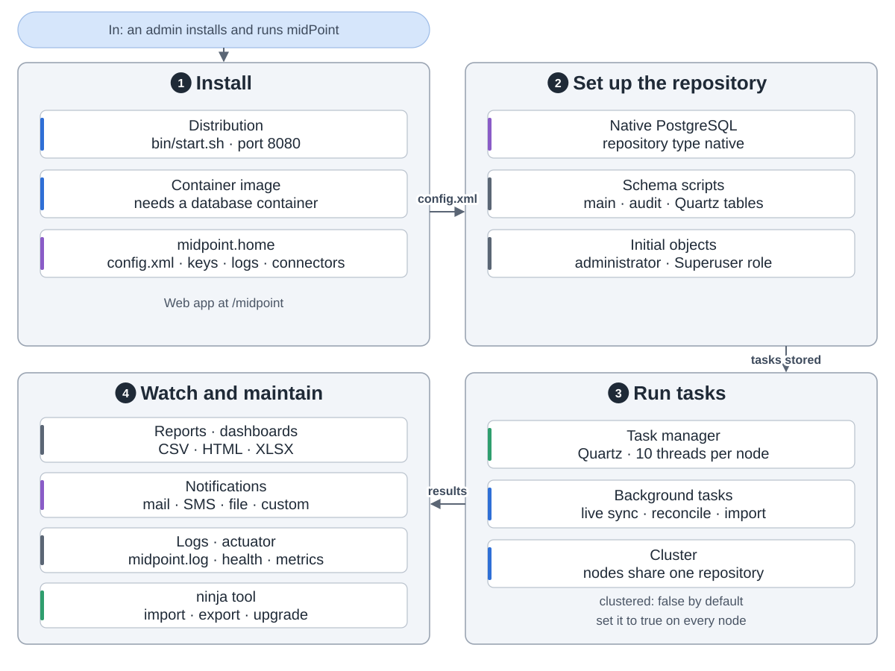
