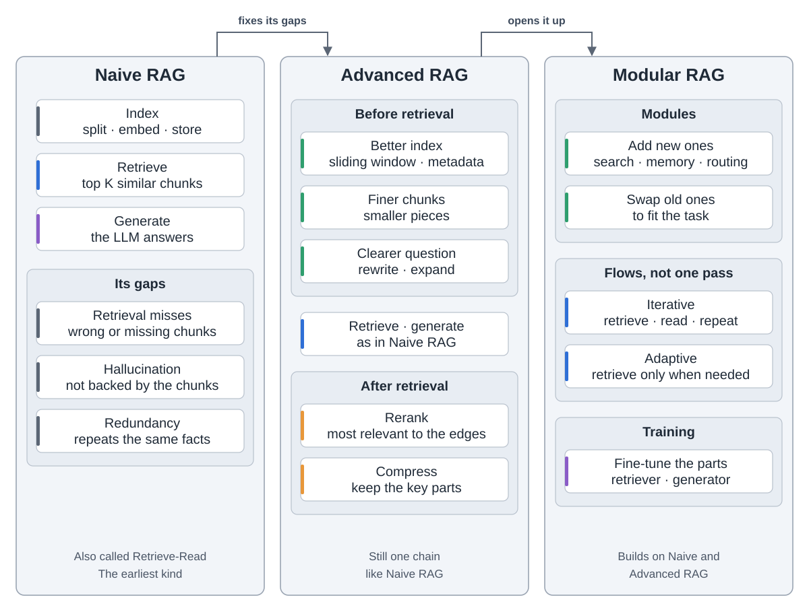
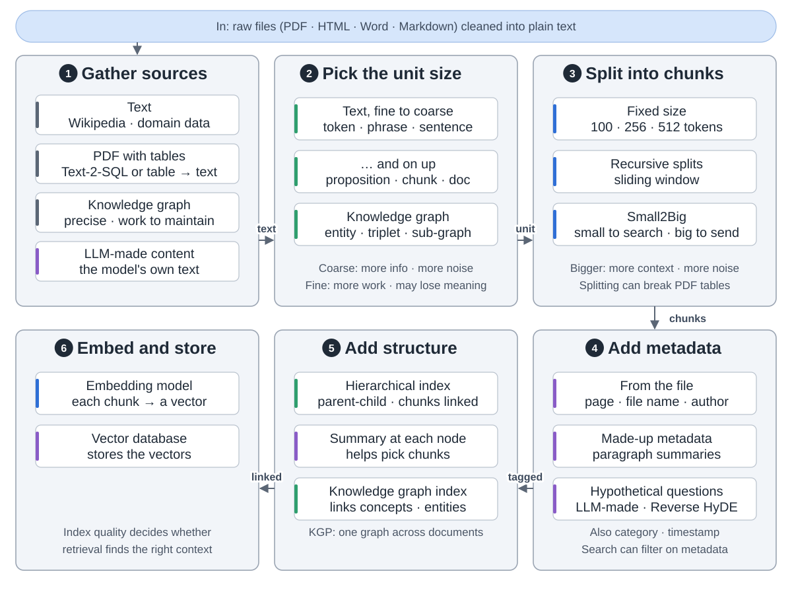
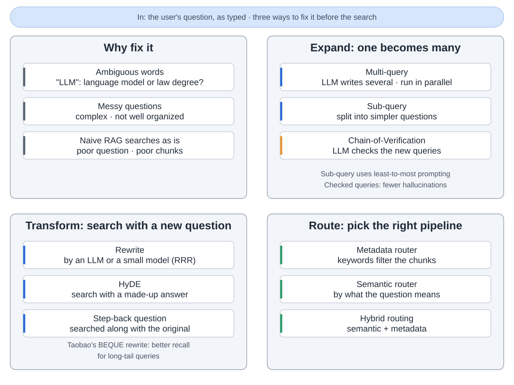
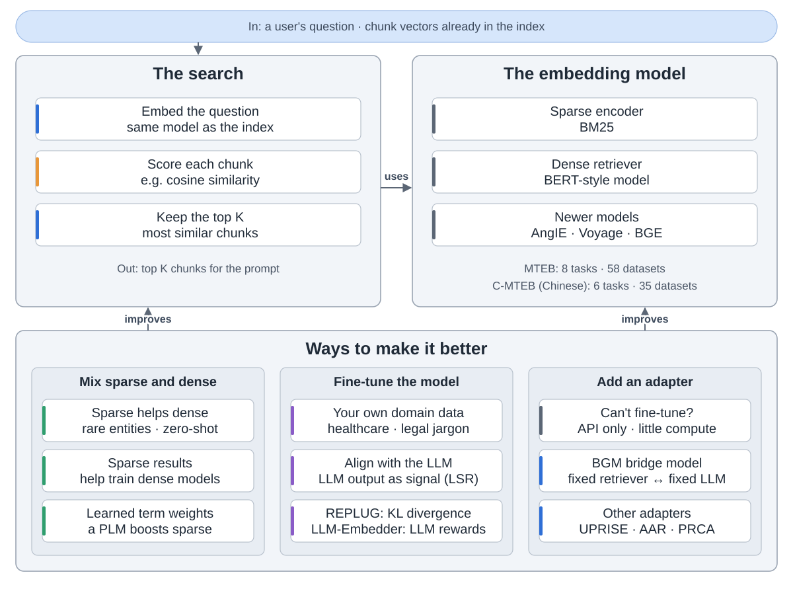
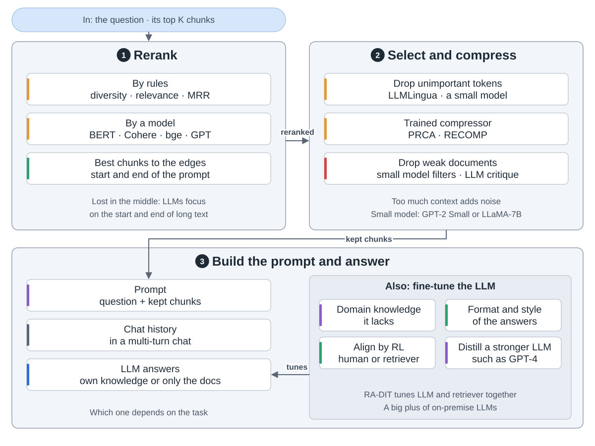
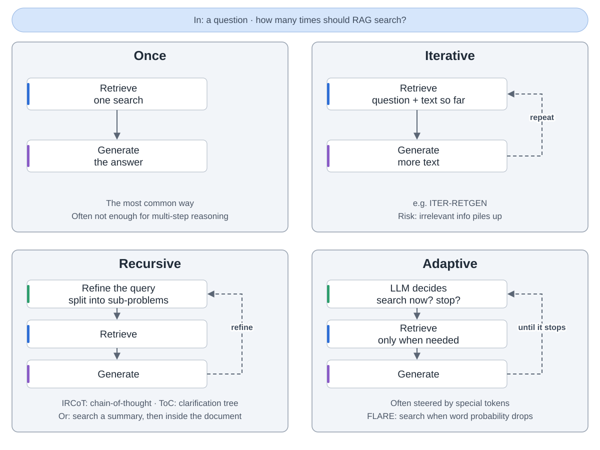
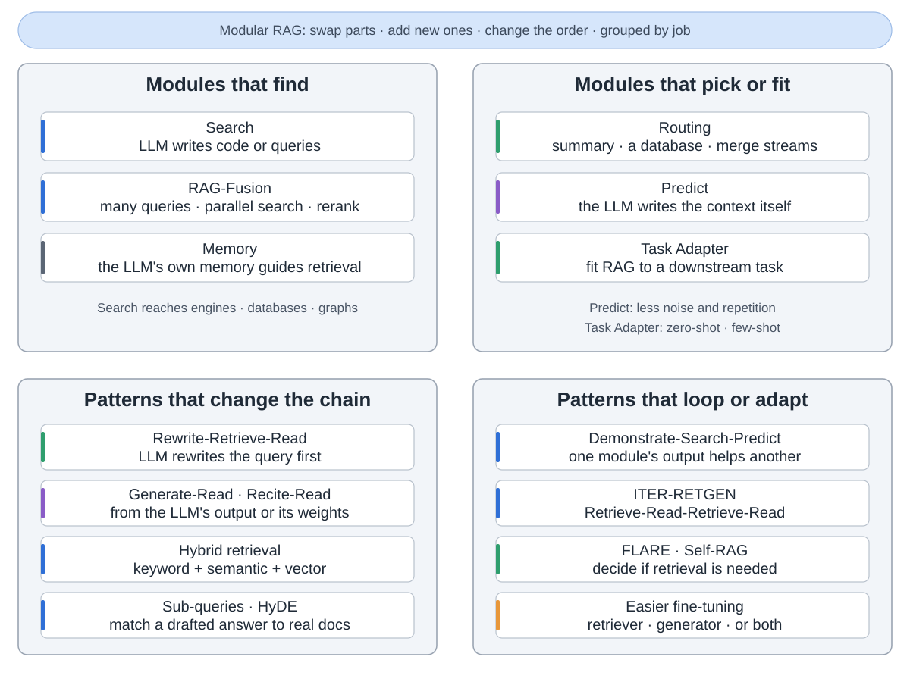
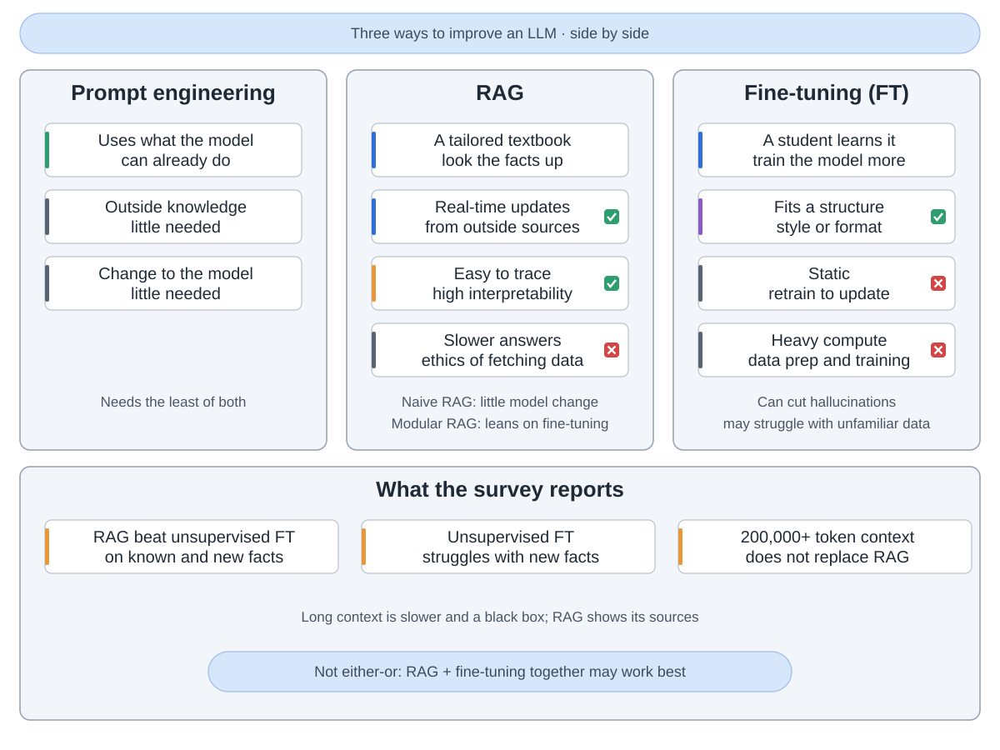
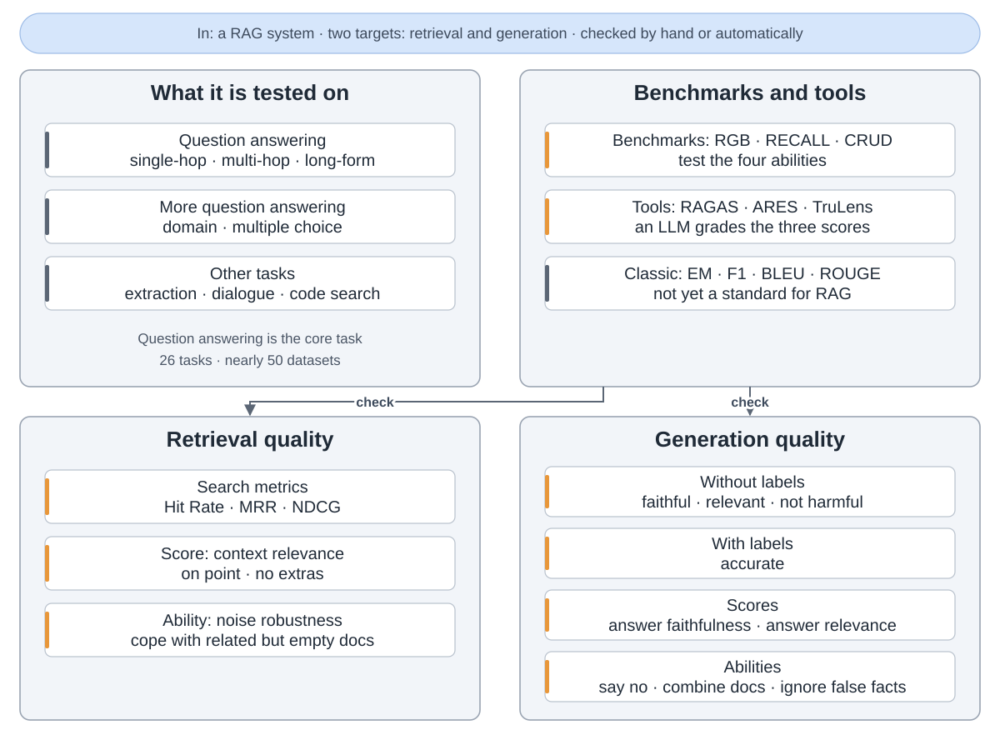

RAG（检索增强生成）让大模型先查你的文档，再回答。本文依据一篇总结了 100 多项研究的综述。

**三种 RAG。** 朴素 RAG 建索引、检索、生成。高级 RAG 在检索前后各加一步。模块化 RAG 可以加、换、重排部件。

**建索引。** 清理文件，切块，加元数据，把每块变成向量存起来。

**改问题。** 问题含糊就会找错块。可以扩展、改写或分流。

**检索**比较问题和每块的向量，留下最像的前 K 块。关键词和向量检索可以互补。

**生成答案。** 块太多会淹没要点。先重排、精简，再让大模型回答。

**搜几次。** 最常见的是搜一次。难题可以反复搜，或让大模型决定何时搜。

**模块。** 模块化 RAG 加了搜索、记忆、路由等部件，还能改变连接方式。

**RAG 还是微调？** RAG 适合会变的事实，还能给出出处。微调适合风格和格式。两者可以一起用。

**检查效果。** 检索和答案分开测：内容是否切题，答案是否忠于内容、答了所问。

