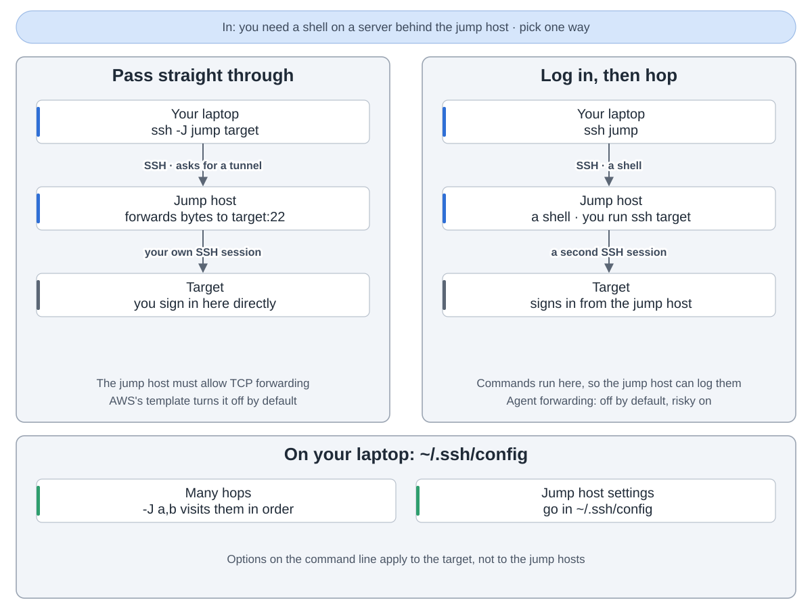
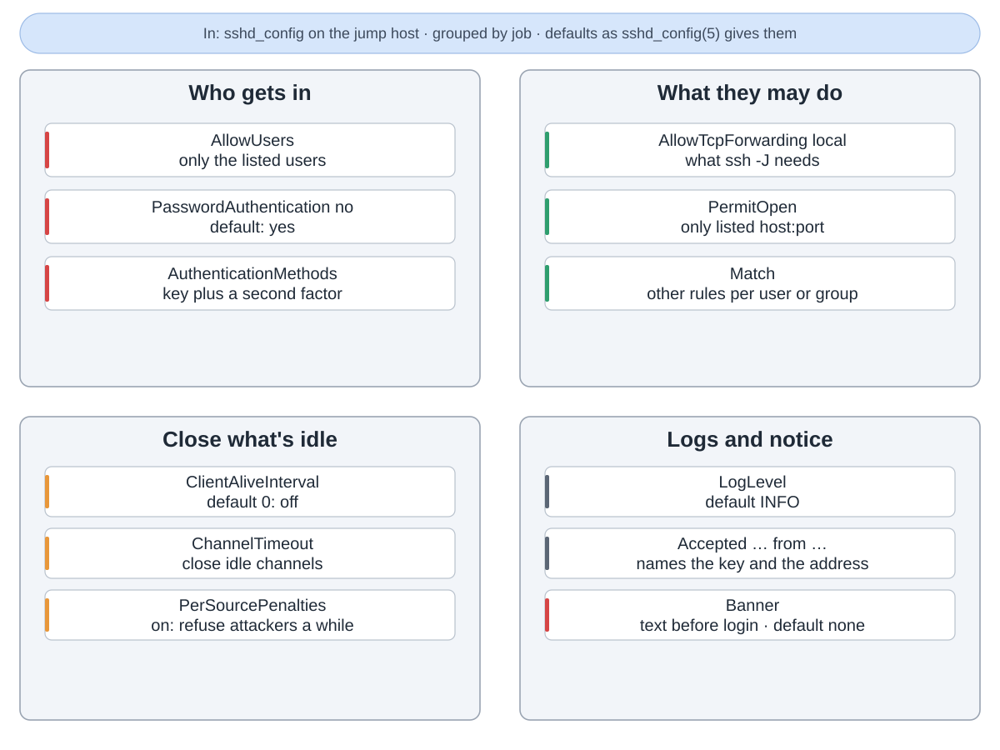
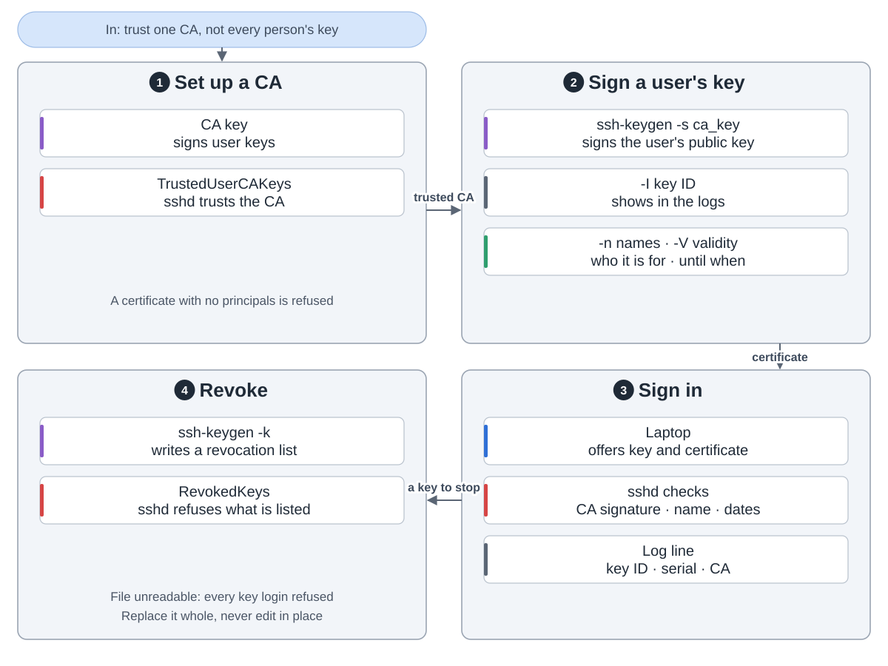
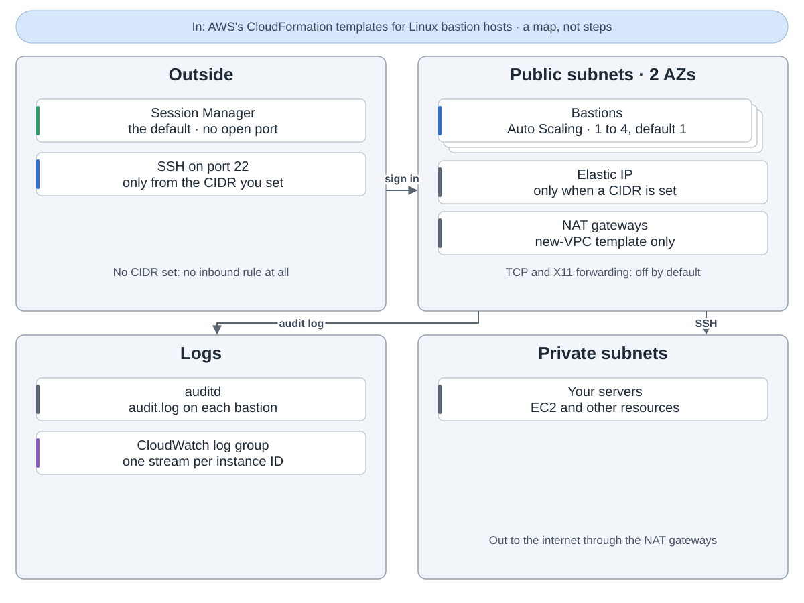

A jump host, or bastion, is the one server you can reach from outside. You sign in there, and only from there do you reach the private servers. One door is easier to lock and to watch.

**Two ways through.** With `ssh -J jump target` the jump host only forwards bytes, and you sign in to the target yourself. Or you log in to the jump host and run ssh from its shell, so the jump host can log every command. Pass-through needs TCP forwarding on the jump host, which AWS's reference template turns off by default.

**Lock the door.** On the jump host's sshd: only listed users, no passwords, a key plus a second factor, forwarding only to listed targets, idle sessions closed. Each accepted login is logged with its key and address.

**Certificates.** Instead of copying keys to every server, a CA signs each person's key with a name and an end date. Servers trust the CA. A lost key goes on a revocation list.

**On AWS.** The aws-ia Linux bastion templates put 1 to 4 bastions in public subnets across two zones. By default no port is open and you come in through Session Manager. Set an address range and SSH from it is allowed. The audit log goes to CloudWatch.

Sources: OpenSSH at commit 6a46ea6 and aws-ia/cfn-ps-linux-bastion at commit 213dd9a.
